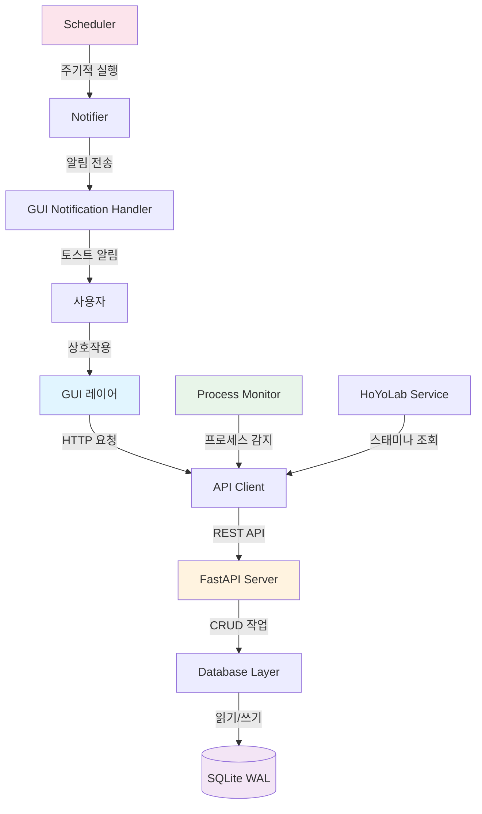
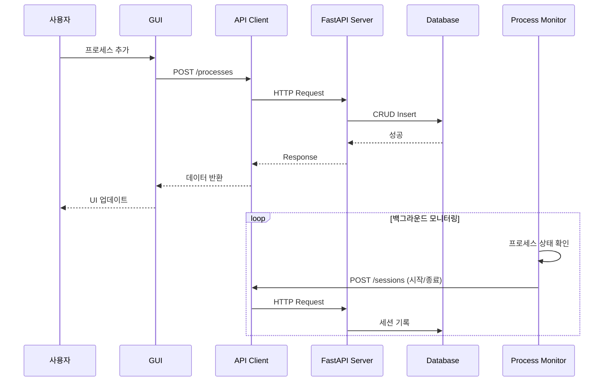

# 📚 HomeworkHelper

<div align="center">


[](https://github.com/lsh930309/HomeworkHelperServer/releases/latest)
[](https://github.com/lsh930309/HomeworkHelperServer/stargazers)
[](https://github.com/lsh930309/HomeworkHelperServer/issues)

**게임 일일 루틴 자동 관리 시스템**

프로세스 모니터링 • 스마트 알림 • HoYoLab 스태미나 추적 • RESTful API

[다운로드](#-설치-방법) • [사용 가이드](#-사용-가이드) • [API 문서](#-api-문서) • [기여하기](#-기여하기)

</div>

---

## 📋 목차

- [개요](#-개요)
- [시스템 아키텍처](#-시스템-아키텍처)
- [주요 기능](#-주요-기능)
- [설치 방법](#-설치-방법)
- [사용 가이드](#-사용-가이드)
- [프로젝트 구조](#-프로젝트-구조)
- [모듈 설명](#-모듈-설명)
- [API 문서](#-api-문서)
- [기술 스택](#-기술-스택)
- [개발 가이드](#-개발-가이드)
- [기여하기](#-기여하기)

---

## 🎯 개요

HomeworkHelper는 **게임 일일 루틴 관리**를 자동화하는 Windows용 데스크톱 애플리케이션입니다.

### 해결하는 문제

- 🎮 **게임 일일 퀘스트 놓침** - 서버 리셋 시간 추적 및 자동 알림
- ⏰ **플레이 시간 관리** - 마지막 플레이 시간 자동 기록 및 데드라인 알림
- 🌐 **웹 루틴 자동화** - 매일 방문해야 하는 사이트 원클릭 실행
- 📊 **게임 패턴 분석** - 세션별 플레이 타임 자동 수집 및 통계
- ⚡ **HoYoLab 스태미나 추적** - 원신, 붕괴: 스타레일, 젠레스 존 제로 스태미나 자동 조회

### 핵심 가치

- **자동화**: 프로세스 모니터링, 세션 트래킹, 알림 발송을 자동으로 처리
- **확장성**: RESTful API로 외부 도구와 연동 가능
- **안정성**: SQLite WAL 모드, 자동 재시도 로직으로 데이터 손실 방지
- **편의성**: 시스템 트레이 상주, 원클릭 실행, 커스터마이징 가능한 알림

---

## 🏗️ 시스템 아키텍처

### 전체 파이프라인



### 데이터 흐름



---

## ✨ 주요 기능

### 🎮 프로세스 모니터링

- **실시간 감지**: 게임/프로그램 실행 상태 자동 감지
- **원클릭 실행**: UI에서 버튼 클릭으로 프로그램 실행
- **세션 트래킹**: 시작/종료 시간, 플레이 시간 자동 기록
- **관리자 권한**: 필요 시 관리자 권한으로 실행

### ⏰ 스마트 알림 시스템

- **서버 리셋 알림**: 일일 퀘스트 리셋 2시간 전 알림
- **사용자 주기 알림**: 24시간 단위 커스텀 주기 관리
- **필수 플레이 시간**: 특정 시간대 플레이 필수 알림
- **수면 시간 보정**: 취침 중 알림 방지 및 기상 후 자동 발송
- **HoYoLab 스태미나 알림**: 스태미나 임계값 도달 시 알림

### 🌐 웹 바로가기 관리

- 일일 리프레시가 필요한 웹사이트 등록
- 리셋 시간 설정 및 자동 추적
- 원클릭 브라우저 실행

### ⚡ HoYoLab 통합

- **지원 게임**: 원신, 붕괴: 스타레일, 젠레스 존 제로
- **자동 로그인**: 브라우저 쿠키 추출로 자동 인증
- **스태미나 추적**: 실시간 스태미나 조회 및 알림
- **자동 보정**: 게임 실행 시 스태미나 자동 보정

### 📊 데이터 트래킹

- **세션 기록**: 게임별 실행 시작/종료 타임스탬프
- **플레이 패턴**: 프로세스별 세션 이력 및 통계
- **RESTful API**: FastAPI 기반 데이터 조회/분석 인터페이스

### 🔧 시스템 기능

- **트레이 상주**: 시스템 트레이에서 백그라운드 실행
- **부팅 시 자동 실행**: Windows 시작 프로그램 등록 (선택)
- **알림 커스터마이징**: 알림별 On/Off 설정
- **창 위치 기억**: 마지막 창 위치 자동 복원
- **마그넷 스냅**: 화면 가장자리 자동 정렬

---

## 🚀 설치 방법

### Option 1: 인스톨러 (권장)

1. [최신 릴리즈](https://github.com/lsh930309/HomeworkHelperServer/releases/latest) 다운로드
2. `HomeworkHelper_Setup_vX.X.X.exe` 실행
3. 설치 마법사에 따라 설치 진행
4. **업데이트 시 작업 표시줄 고정 아이콘 유지**

### Option 2: Portable 버전

1. [최신 릴리즈](https://github.com/lsh930309/HomeworkHelperServer/releases/latest)에서 `HomeworkHelper_Portable.zip` 다운로드
2. 원하는 폴더에 압축 해제
3. `homework_helper.exe` 실행

### Option 3: 소스코드 실행

```bash
# 1. 저장소 클론
git clone https://github.com/lsh930309/HomeworkHelperServer.git
cd HomeworkHelperServer

# 2. 가상환경 생성 (권장)
python -m venv .venv
.venv\Scripts\activate  # Windows

# 3. 의존성 설치
pip install -r requirements.txt

# 4. 프로그램 실행
python homework_helper.pyw
```

---

## 📖 사용 가이드

### 1️⃣ 프로세스 추가하기

<details>
<summary><b>게임/프로그램 등록 방법</b></summary>

1. **메인 화면에서 `프로세스 추가` 버튼 클릭**
2. **필수 정보 입력:**
   - 📝 **이름**: 표시될 프로세스 이름
   - 📂 **모니터링 경로**: 프로세스 실행 파일 경로 (감지용)
   - 🚀 **실행 경로**: 버튼 클릭 시 실행할 파일 경로

3. **선택 정보 입력:**
   - 🔄 **서버 리셋 시간**: 일일 퀘스트가 리셋되는 시간 (예: 04:00)
   - ⏱️ **사용자 주기**: 플레이 주기 (기본 24시간)
   - ⭐ **필수 플레이 시간**: 특정 시간대에 플레이 필수 (여러 개 설정 가능)
   - ⚡ **HoYoLab 연동**: 스태미나 추적 활성화

4. **저장 완료** - 프로세스가 자동 모니터링 시작

</details>

### 2️⃣ 웹 바로가기 추가하기

<details>
<summary><b>일일 웹사이트 등록 방법</b></summary>

1. **`웹 바로가기 추가` 버튼 클릭**
2. **정보 입력:**
   - 📝 **이름**: 바로가기 이름
   - 🌐 **URL**: 웹사이트 주소
   - 🔄 **리프레시 시간**: 일일 리셋 시간 (선택)

3. **저장** - 원클릭 실행 버튼 생성

</details>

### 3️⃣ HoYoLab 스태미나 추적 설정

<details>
<summary><b>HoYoLab 연동 방법</b></summary>

1. **프로세스 편집에서 `HoYoLab 연동` 활성화**
2. **스태미나 추적 설정:**
   - 게임 선택 (원신, 붕괴: 스타레일, 젠레스 존 제로)
   - 알림 임계값 설정 (예: 160/240)

3. **브라우저 쿠키 자동 추출:**
   - Chrome, Edge, Firefox 지원
   - HoYoLab 로그인 상태 유지 필요

4. **자동 조회:**
   - 10분마다 스태미나 자동 조회
   - 임계값 도달 시 알림 발송
   - 게임 실행 시 스태미나 자동 보정

</details>

### 4️⃣ 알림 설정하기

<details>
<summary><b>알림 커스터마이징</b></summary>

1. **설정(⚙️) 버튼 클릭**
2. **알림 옵션 선택:**
   - ✅ 게임 실행 성공/실패 알림
   - ✅ 필수 플레이 시간 알림
   - ✅ 주기 데드라인 알림
   - ✅ 수면 시간 보정 알림
   - ✅ 일일 리셋 알림
   - ✅ HoYoLab 스태미나 알림

3. **수면 시간 설정:**
   - 시작 시간 / 종료 시간 설정
   - 수면 중 알림을 기상 후로 연기

</details>

### 5️⃣ 세션 데이터 조회하기

<details>
<summary><b>플레이 기록 분석</b></summary>

**API 엔드포인트 사용:**

```bash
# FastAPI 서버가 자동으로 백그라운드에서 실행됩니다.
# 브라우저에서 http://127.0.0.1:8000/docs 접속

# 1. 모든 세션 조회
GET http://127.0.0.1:8000/sessions

# 2. 특정 게임의 세션 이력
GET http://127.0.0.1:8000/sessions/process/{process_id}

# 3. 현재 활성 세션 확인
GET http://127.0.0.1:8000/sessions/process/{process_id}/active
```

**응답 예시:**
```json
[
  {
    "id": 1,
    "process_id": "6d101682-c386-4a1c-8696-3d4d5f85cf09",
    "process_name": "젠레스 존 제로",
    "start_timestamp": 1759405875.473616,
    "end_timestamp": 1759405938.1449769,
    "session_duration": 62.67
  }
]
```

</details>

---

## 📁 프로젝트 구조

```
HomeworkHelperServer/
├── 📱 메인 애플리케이션
│   ├── homework_helper.pyw       # 진입점
│   ├── homework_helper.spec      # PyInstaller 빌드 설정
│   ├── build.py                  # 빌드 자동화 스크립트
│   ├── installer.iss             # Inno Setup 인스톨러 스크립트
│   └── requirements.txt          # 의존성 목록
│
├── 🔧 src/                       # 소스 코드
│   ├── api/                      # API 클라이언트
│   │   └── client.py             # FastAPI 서버와 통신
│   │
│   ├── core/                     # 핵심 로직
│   │   ├── instance_manager.py  # 싱글톤 인스턴스 관리
│   │   ├── launcher.py          # 프로세스 실행
│   │   ├── notifier.py          # 알림 시스템
│   │   ├── process_monitor.py   # 프로세스 모니터링
│   │   └── scheduler.py         # 스케줄링 및 알림 로직
│   │
│   ├── data/                     # 데이터 레이어
│   │   ├── crud.py              # CRUD 작업
│   │   ├── data_models.py       # 도메인 모델
│   │   ├── database.py          # SQLite WAL 설정
│   │   ├── models.py            # SQLAlchemy ORM 모델
│   │   ├── schemas.py           # Pydantic 검증 스키마
│   │   ├── manager.py           # 데이터 관리자
│   │   └── game_presets.json    # 게임 프리셋 정의
│   │
│   ├── gui/                      # GUI 레이어
│   │   ├── dialogs.py           # 프로세스/바로가기 추가 다이얼로그
│   │   ├── gui_notification_handler.py  # GUI 알림 핸들러
│   │   ├── main_window.py       # 메인 윈도우
│   │   ├── preset_editor_dialog.py      # 게임 프리셋 편집기
│   │   └── tray_manager.py      # 시스템 트레이 관리
│   │
│   ├── services/                 # 외부 서비스 통합
│   │   └── hoyolab.py           # HoYoLab API (스태미나 조회)
│   │
│   └── utils/                    # 유틸리티
│       ├── admin.py             # 관리자 권한 처리
│       ├── browser_cookie_extractor.py  # 브라우저 쿠키 추출
│       ├── common.py            # 공통 유틸리티
│       ├── game_preset_manager.py       # 게임 프리셋 관리
│       ├── hoyolab_config.py    # HoYoLab 설정
│       ├── icon_helper.py       # 아이콘 경로 해석
│       ├── launcher_utils.py    # 런처 유틸리티
│       ├── lsh_installer.py     # 설치 관리
│       ├── process.py           # 프로세스 유틸리티
│       └── windows.py           # Windows API 래퍼
│
├── 📚 docs/                      # 문서
│   ├── architecture.md          # 아키텍처 가이드
│   ├── milestone.md             # 마일스톤 로드맵
│   ├── git-workflow.md          # Git 워크플로우
│   ├── guides/                  # 사용 가이드
│   │   ├── build-guide.md
│   │   └── multi-pc-sync-guide.md
│   ├── archive/                 # 과거 작업 기록
│   └── archived/                # 보류된 문서
│
├── 🎨 assets/                    # 리소스
│   ├── icons/                   # 아이콘
│   │   ├── app/                 # 앱 아이콘
│   │   └── games/               # 시스템 프리셋 스태미나 아이콘
│   └── fonts/                   # 폰트 파일
│
└── ⚙️ 설정
    ├── .claude/                 # Claude Code 설정
    ├── .gitignore
    └── .gitattributes
```

---

## 🔍 모듈 설명

### 📡 API Client (`src/api/client.py`)

FastAPI 서버와 통신하는 HTTP 클라이언트

**핵심 기능:**
- RESTful API 요청 관리
- 자동 재시도 및 에러 핸들링
- 데이터 캐싱 및 동기화

**주요 메서드:**
- `get_processes()`: 모든 프로세스 조회
- `create_process()`: 새 프로세스 등록
- `start_session()`: 세션 시작 기록
- `end_session()`: 세션 종료 기록

---

### 🎯 Core 모듈

#### `instance_manager.py` - 싱글톤 관리
- API 클라이언트, 데이터베이스 세션 등 싱글톤 인스턴스 관리
- 애플리케이션 전역에서 단일 인스턴스 보장

#### `launcher.py` - 프로세스 실행
- 프로세스 실행 및 관리자 권한 처리
- 실행 결과 검증 및 에러 핸들링

#### `notifier.py` - 알림 시스템
- Windows 토스트 알림 발송
- 알림 우선순위 및 중복 방지

#### `process_monitor.py` - 프로세스 모니터링
- `psutil`을 사용한 프로세스 상태 감지
- 시작/종료 이벤트 자동 기록
- 백그라운드 스레드로 실시간 모니터링

#### `scheduler.py` - 스케줄링
- 주기적 알림 스케줄링
- 서버 리셋, 사용자 주기, 필수 플레이 시간 관리
- 수면 시간 보정 로직

---

### 💾 Data 모듈

#### `database.py` - DB 설정
- SQLite WAL 모드 설정
- 동시 읽기/쓰기 지원
- 데이터 손실 방지

#### `models.py` - ORM 모델
- `Process`: 프로세스 정보
- `Shortcut`: 웹 바로가기
- `Session`: 세션 기록
- `Settings`: 전역 설정

#### `schemas.py` - Pydantic 스키마
- API 요청/응답 검증
- 타입 안전성 보장

#### `crud.py` - CRUD 작업
- 데이터베이스 CRUD 로직
- 자동 재시도 데코레이터 (`@db_retry_on_lock`)
- 트랜잭션 관리

#### `data_models.py` - 도메인 모델
- 비즈니스 로직을 포함한 도메인 객체
- 알림 계산, 상태 관리

---

### 🖥️ GUI 모듈

#### `main_window.py` - 메인 윈도우
- 프로세스 목록 표시
- 실행 버튼 및 상태 표시
- 창 위치 기억 및 마그넷 스냅

#### `dialogs.py` - 다이얼로그
- 프로세스 추가/편집 다이얼로그
- 웹 바로가기 추가/편집 다이얼로그
- 설정 다이얼로그

#### `tray_manager.py` - 트레이 관리
- 시스템 트레이 아이콘
- 컨텍스트 메뉴
- 더블클릭으로 메인 윈도우 열기

#### `gui_notification_handler.py` - GUI 알림
- GUI 이벤트 루프와 통합
- 알림 큐 관리

---

### 🌐 Services 모듈

#### `hoyolab.py` - HoYoLab 통합
- 원신, 붕괴: 스타레일, 젠레스 존 제로 API
- 스태미나 실시간 조회
- 브라우저 쿠키 기반 자동 로그인
- 스태미나 보정 로직

**지원 기능:**
- 실시간 스태미나 조회
- 회복 완료 시간 계산
- 게임 실행 시 자동 보정 (현재 스태미나 - 최대 스태미나)

---

### 🛠️ Utils 모듈

다양한 유틸리티 함수들:
- `admin.py`: 관리자 권한 확인 및 재실행
- `browser_cookie_extractor.py`: Chrome/Edge/Firefox 쿠키 추출
- `common.py`: 공통 유틸리티 (시간 변환, 검증 등)
- `game_preset_manager.py`: 게임 프리셋 관리
- `windows.py`: Windows API 래퍼 (창 제어, 파일 선택 등)

---

## 📡 API 문서

### 기본 정보

- **Base URL**: `http://127.0.0.1:8000`
- **Interactive Docs**: [http://127.0.0.1:8000/docs](http://127.0.0.1:8000/docs)
- **OpenAPI Schema**: [http://127.0.0.1:8000/openapi.json](http://127.0.0.1:8000/openapi.json)

### 주요 엔드포인트

#### 프로세스 관리
```http
GET    /processes              # 모든 프로세스 조회
GET    /processes/{id}         # 특정 프로세스 조회
POST   /processes              # 프로세스 추가
PUT    /processes/{id}         # 프로세스 수정
DELETE /processes/{id}         # 프로세스 삭제
```

#### 세션 트래킹
```http
POST   /sessions                          # 세션 시작 기록
PUT    /sessions/{session_id}/end         # 세션 종료 기록
GET    /sessions                          # 모든 세션 조회
GET    /sessions/process/{process_id}     # 프로세스별 세션 이력
GET    /sessions/process/{process_id}/active  # 활성 세션 조회
```

#### 웹 바로가기
```http
GET    /shortcuts              # 모든 바로가기 조회
POST   /shortcuts              # 바로가기 추가
PUT    /shortcuts/{id}         # 바로가기 수정
DELETE /shortcuts/{id}         # 바로가기 삭제
```

#### HoYoLab
```http
GET    /hoyolab/stamina/{process_id}      # 스태미나 조회
POST   /hoyolab/correct/{process_id}      # 스태미나 보정
```

#### 설정
```http
GET    /settings               # 전역 설정 조회
PUT    /settings               # 전역 설정 수정
```

---

## 🛠️ 기술 스택

### 핵심 라이브러리

| 라이브러리 | 버전 | 용도 |
|----------|------|------|
| **Python** | 3.11+ | 메인 런타임 |
| **FastAPI** | 0.116 | RESTful API 서버 |
| **SQLAlchemy** | 2.0 | ORM 및 데이터베이스 관리 |
| **PyQt6** | 6.9 | GUI 프레임워크 |
| **psutil** | 7.1 | 프로세스 모니터링 |
| **uvicorn** | 0.35 | ASGI 서버 |
| **Pydantic** | 2.11 | 데이터 검증 |
| **requests** | 2.32 | HTTP 클라이언트 |
| **genshin** | 1.6+ | HoYoLab API |
| **PyInstaller** | 6.x | 실행 파일 빌드 |
| **tqdm** | 4.67 | 진행률 표시 |

### 데이터베이스

- **SQLite**: 경량 임베디드 데이터베이스
- **WAL 모드**: 동시 읽기/쓰기 지원
- **자동 재시도**: 락 발생 시 자동 재시도 (지수 백오프)

---

## 👨‍💻 개발 가이드

### 빌드하기

```bash
# 빌드 스크립트 실행 (Windows)
python build.py

# 버전 선택 (방향키로 조작)
# - 좌/우: 자릿수 이동
# - 상/하: 숫자 증가/감소
# - Enter: 확정

# 빌드 산출물
# - release/HomeworkHelper_vX.Y.Z.timestamp_Setup.exe (인스톨러)
# - release/HomeworkHelper_vX.Y.Z.timestamp_Portable.zip (Portable)
```

**빌드 스크립트 특징:**
- 이전 버전 자동 아카이빙 (`release/archives/`)
- PyInstaller 빌드 (onedir 모드)
- ZIP 압축 (Portable 버전)
- Inno Setup 인스톨러 생성
- **tqdm 진행률 표시** (빌드, 압축, 인스톨러 생성)
- **실시간 출력** (ANSI escape 코드로 잔상 방지)

### 개발 환경 설정

1. **필수 도구:**
   - Python 3.11+
   - Git
   - Inno Setup 6 (인스톨러 생성 시)

2. **의존성 설치:**
   ```bash
   pip install -r requirements.txt
   ```

3. **실행:**
   ```bash
   python homework_helper.pyw
   ```

### 코드 스타일

- **커밋 메시지**: `카테고리: 설명` 형식 (예: `기능 추가: HoYoLab 스태미나 추적`)
- **브랜치 전략**: [Git 워크플로우](docs/git-workflow.md) 참조
- **문서화**: 주요 기능 변경 시 문서 업데이트

---

## 🔒 데이터 안전성

### 구현된 보호 장치

1. **WAL (Write-Ahead Logging) 모드**
   - 동시 읽기/쓰기 지원
   - 데이터 손실 방지

2. **자동 재시도 로직**
   - DB 락 발생 시 최대 3회 재시도
   - 지수 백오프 적용 (100ms, 200ms, 300ms)

3. **예외 처리**
   - `OperationalError`, `IntegrityError` 핸들링
   - 로깅 시스템 통합

4. **트랜잭션 관리**
   - SQLAlchemy 세션 자동 관리
   - 실패 시 자동 롤백

---

## 🎓 튜토리얼: 첫 게임 등록하기

### 예시: 붕괴: 스타레일 등록 (HoYoLab 연동)

1. **프로세스 추가 버튼 클릭**

2. **기본 정보 입력:**
   ```
   이름: 붕괴: 스타레일
   모니터링 경로: C:\Program Files\Star Rail\Game\StarRail.exe
   실행 경로: C:\Program Files\Star Rail\launcher.exe
   서버 리셋 시간: 04:00
   사용자 주기: 24시간
   ```

3. **HoYoLab 연동 설정:**
   - `HoYoLab 연동` 체크
   - 게임: `붕괴: 스타레일`
   - 알림 임계값: `160/240`

4. **필수 플레이 시간 추가 (선택):**
   - `필수 시간 활성화` 체크
   - `21:00` 추가

5. **저장 완료**
   - 게임 실행 자동 감지
   - 세션 시작/종료 자동 기록
   - 10분마다 스태미나 자동 조회
   - 임계값 도달 시 알림

---

## 🤝 기여하기

기여는 언제나 환영합니다!

1. Fork the Project
2. Create your Feature Branch (`git checkout -b feature/AmazingFeature`)
3. Commit your Changes (`git commit -m '기능 추가: 멋진 기능'`)
4. Push to the Branch (`git push origin feature/AmazingFeature`)
5. Open a Pull Request

### 기여 가이드라인

- **코드 스타일**: 기존 코드 스타일 유지
- **커밋 메시지**: 한국어로 작성, `카테고리: 설명` 형식
- **문서화**: 새 기능 추가 시 README 및 관련 문서 업데이트
- **테스트**: 변경 사항이 정상 작동하는지 확인

---

## 📜 라이선스

이 프로젝트는 MIT 라이선스 하에 배포됩니다. 자세한 내용은 [LICENSE](LICENSE) 파일을 참조하세요.

---

## 📧 문의

프로젝트 관련 문의사항이나 버그 제보는 [Issues](https://github.com/lsh930309/HomeworkHelperServer/issues) 페이지를 이용해주세요.

---

<div align="center">

**Made with ❤️ for gamers who never miss daily quests**

⭐ 이 프로젝트가 도움이 되었다면 Star를 눌러주세요!

[맨 위로 ⬆](#-homeworkhelper)

</div>
