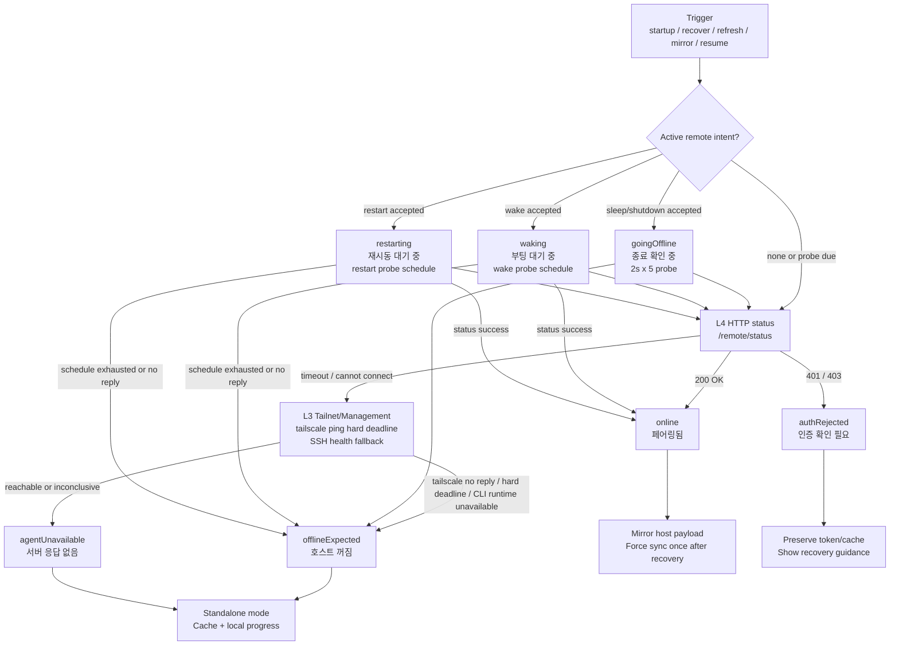

# Remote Connection Supervisor & Power Management

## 1. 전원 관리 시나리오 및 동작 표

| 시나리오 | 입력/신호 | 클라이언트 즉시 상태 | 이후 확인 로직 | 최종 기대 상태 | 비고 |
| --- | --- | --- | --- | --- | --- |
| 정상 온라인 | `/remote/status` 성공 | `online` / `페어링됨` | revision 변경 또는 offline 복구 후 payload sync | `online` | 연결 복구 직후에는 revision이 같아도 1회 강제 sync |
| 호스트가 외부에서 꺼짐/절전 | HTTP 실패 + Tailscale ping no reply/hard deadline | `offlineExpected` / `호스트 꺼짐` | 캐시 로드, local progress 재계산, 60초 cadence | `offlineExpected` | 현재 SSH도 Tailscale IP에 의존하므로 Tailnet/Management layer 단절로 판단 |
| Remote Agent만 응답 없음 | HTTP 실패 + Tailnet/Management reachable/skipped/inconclusive | `agentUnavailable` / `서버 응답 없음` | blind reconnect burst 없이 standalone 유지 | `agentUnavailable` | HTTP와 하위 관리 계층을 분리해 호스트 전원 꺼짐과 서버/포트 문제를 분리 |
| 인증 거부 | HTTP 401/403 | `authRejected` / `인증 확인 필요` | 자동 재연결 schedule 비움 | `authRejected` | 로컬 token/cache는 보존, 사용자 확인 필요 |
| 클라이언트에서 wake 명령 수락 | SmartThings/local wake 성공 또는 remote wake accepted | `waking` / `부팅 대기 중` | wake schedule로 빠르게 status probe | `online` 또는 `offlineExpected` | 온라인 복구 시 payload 강제 sync |
| 클라이언트에서 sleep/shutdown 명령 수락 | power adapter가 explicit accepted signal 반환 | `goingOffline` / `종료 확인 중` | 2초 x 5회 expected-offline 확인 | `offlineExpected` / `호스트 꺼짐` | 예상된 disconnect이므로 `reconnecting` 장기 체류 방지 |
| 클라이언트에서 restart 명령 수락 | power adapter가 explicit accepted signal 반환 | `restarting` / `재시동 대기 중` | 5초 대기 후 wake schedule | `online` 또는 `offlineExpected` | 복구 성공 시 payload 강제 sync |
| Mac client wake/resume | `NSWorkspace.didWakeNotification` 또는 disconnected 중 app active | 현재 상태 유지 | local progress 즉시 갱신 후 immediate probe | probe 결과에 따름 | client sleep/power-off 자체는 세부 시나리오로 확장하지 않음 |

## 2. Layered Connectivity Protocol

연결 상태는 HTTP timeout 하나로 판정하지 않고, custom protocol의 계층별 evidence를 합산한다.

| Layer | 이름 | Probe | 의미 |
| --- | --- | --- | --- |
| L4 | HTTP Agent | `/remote/status` | Remote Agent, HTTP 포트, auth, host runtime까지 모두 만족해야 성공 |
| L3 | Tailnet/Management | `tailscale ping` + Tailscale IP 기반 SSH health | 현재 환경에서는 SSH가 Tailscale IP에 의존하므로 하나의 묶음으로 판단 |
| L2 | Power/Reachability inference | L4 실패 + L3 no-reply/hard deadline | Tailscale off 또는 host power off/hibernate로 간주 |
| L1 | Local Cache | cached processes + local progress ticker | 연결과 무관하게 standalone UI 유지 |
| Overlay | Remote intent | wake/sleep/restart/shutdown accepted signal | 관측값이 아니라 비동기 기대 상태로 UI 상태에 overlay |

Tailscale CLI 실행은 패키지 앱이 사용자의 zsh alias를 자동 상속하지 않는다는 전제에서 해석한다. macOS client는 `/opt/homebrew/bin/tailscale`, `/usr/local/bin/tailscale` 같은 실제 CLI wrapper를 먼저 시도하고, 없으면 `/bin/zsh -lic tailscale ...`로 interactive zsh alias를 명시적으로 시도한 뒤, 마지막으로 `/Applications/Tailscale.app/Contents/MacOS/Tailscale` 앱 번들 실행 파일을 fallback으로 사용한다. 각 후보의 executable path, exit status, stdout, stderr는 connectivity 로그에 남긴다.

## 3. Connectivity Supervisor 알고리즘 순서도

상태 모델은 9개 UI state를 사용하지만, 장기적으로 수렴하는 안정 상태는 4개다. `goingOffline`, `waking`, `restarting`, `reconnecting`, `unknown`은 probe schedule을 가진 transient state이며, 최종적으로 아래 4개 outcome 중 하나로 정리된다.

| 구분 | State | UI 라벨 | 의미 |
| --- | --- | --- | --- |
| 안정 상태 | `online` | 페어링됨 | 호스트와 Remote Agent가 모두 사용 가능 |
| 안정 상태 | `offlineExpected` | 호스트 꺼짐 | 호스트 전원 off/sleep/hibernate 또는 Tailscale no-reply |
| 안정 상태 | `agentUnavailable` | 서버 응답 없음 | 호스트 네트워크는 가능성이 있으나 Remote Agent/HTTP가 불가 |
| 안정 상태 | `authRejected` | 인증 확인 필요 | 저장 token이 호스트에서 거부됨 |
| 일시 상태 | `goingOffline` | 종료 확인 중 | 사용자가 sleep/shutdown을 요청했고 단절이 예상됨 |
| 일시 상태 | `waking` | 부팅 대기 중 | 사용자가 wake를 요청했고 복구를 빠르게 확인 중 |
| 일시 상태 | `restarting` | 재시동 대기 중 | 사용자가 restart를 요청했고 단절/복구를 기다림 |
| 일시 상태 | `reconnecting` | 재연결 중 | 예상되지 않은 HTTP 단절을 짧게 확인 중 |
| 일시 상태 | `unknown` | 상태 확인 중 | 아직 충분한 신호가 없음 |

## 4. 전원 명령 acceptance 원칙

- Connectivity supervisor는 SSH stderr/stdout 문자열을 직접 해석하지 않는다.
- 전원 adapter가 명령 수락 여부를 typed signal로 결정하고, supervisor는 `powerIntentAccepted(action:)` 이벤트만 해석한다.
- macOS local SSH adapter는 Windows command에 `__HH_REMOTE_POWER_ACCEPTED__` marker를 붙이고, SSH 출력에서 marker가 확인될 때만 accepted로 본다.
- Timeout, no route, permission denied처럼 marker가 없는 실패는 accepted로 보지 않는다.
- Accepted 후 발생하는 연결 끊김은 사용자 의도 전원 전환의 후속 현상으로 보고 `goingOffline` / `restarting` schedule에서 처리한다.

## 5. 빌드/런타임 진단 원칙

- `build.py --target macos-client`는 `tools/package_macos_remote_app.py`에 release id, git hash, dirty 여부를 전달하고, `.app`의 `Info.plist`에 `HHRemoteReleaseID`, `HHRemoteGitHash`, `HHRemoteGitDirty`로 기록한다.
- 패키징 단계에서는 Swift release binary와 app bundle binary의 SHA256을 출력하고, 둘이 다르면 실패한다.
- macOS client는 connectivity 평가마다 `~/Desktop/HomeworkHelperRemoteClient.log`에 `connectivity.evaluate` JSON line을 남긴다.
- 로그에는 trigger, HTTP outcome/failure kind/elapsed, Tailscale outcome/message/elapsed/executable/stdout/stderr/exit status, SSH outcome/message/elapsed/executable/stdout/stderr/exit status, final state/label, bundle release metadata가 포함된다.
- 실제 UI badge와 시뮬레이션 결과가 다르면 먼저 이 로그의 `bundle_release_id`, `trigger`, `final_state`, `tailscale_outcome`, `tailscale_executable_path`, `tailscale_stderr`를 비교한다.
