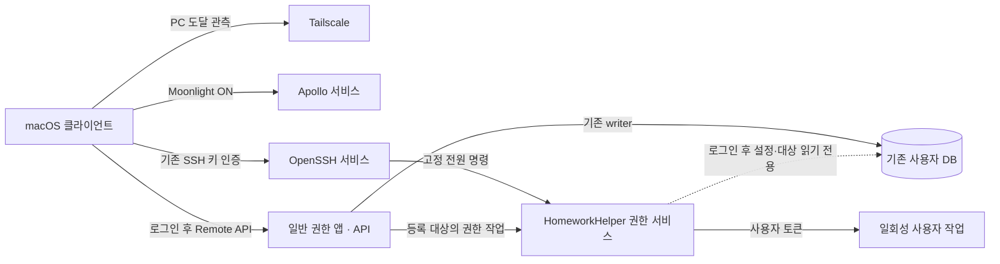

# Windows 호스트 수명주기와 권한 계약

## 사용자 동작

`lsh-desktop`은 사용자 로그인 전에도 Tailscale로 도달하고 Apollo/Moonlight로 로그인
화면에 접근할 수 있어야 한다. 이 상태를 전체 HomeworkHelper 준비 완료로 표시하지 않는다.
게임 데이터, 자동 출석, 게임 실행 등 전체 기능은 지정 사용자의 로그인과 앱 준비 이후 제공한다.
앱과 API는 일반 사용자 권한으로 실행하고 관리자 작업만 Windows 서비스에 요청한다.
설치·업데이트 시 승인은 필요하지만 정상 운영 중 UAC를 표시하지 않는다.

## 구조와 권위



- Tailscale와 Apollo는 Windows 자동 시작 서비스로 로그인 전 연결을 제공한다.
- 권한 서비스는 SYSTEM으로 실행하며 네트워크 포트를 열지 않는다. Windows SCM이
  수명주기를 관리한다. Qt, API, DB writer, 자동 출석은 서비스에 로드하지 않는다.
- 앱/API가 기존 사용자 데이터의 writer다. 권한 서비스는 로그인한 지정 사용자의
  설정과 등록 대상만 읽기 전용으로 조회하며 파일·디렉터리·DB를 만들거나 migrate하지 않는다.
- 설치 시 지정한 사용자 SID는 서비스 설치 설정의 단일 권위다. 초기 운영 대상은
  `lsh-desktop`의 `lsh93`다. 다른 사용자에게 자동 전환하지 않는다.
- 서비스에 게임 DB 복제본, 별도 페어링 저장소, 대상별 관리자 승인 목록을 만들지 않는다.

## 로그인과 권한

`run_on_startup`은 자동 시작 여부의 단일 설정이다. 지정 사용자의 로그인 이벤트에서
일반 사용자 토큰으로 앱을 한 번 시작한다. 잠금 해제는 로그인으로 처리하지 않고,
사용자가 닫은 앱을 반복 재시작하지 않는다. 기존 Startup 바로가기와 관리자/일반 예약
작업은 설치 전환 시 제거한다. GUI가 API를 소유하는 기존 수명주기는 유지한다.

`run_as_admin`은 관리자 기능 사용 여부다. 설정 변경은 앱을 재시작하지 않고 다음
작업에 적용한다. 일반 게임은 기본 사용자 토큰, 기존 관리자 정책상 상승 대상은
로그인한 관리자의 linked token으로 실행한다. 토큰이 없거나 표준 사용자이면 상승
작업을 거부한다. SYSTEM 토큰으로 게임을 대신 실행하지 않는다.

서비스 장애·미등록 시 일반 기능은 유지하고 권한 작업은 명시적으로 실패한다.
ShellExecute `runas`, 임시 예약 작업 등 자동 상승 fallback은 제공하지 않는다.
게임·런처 재시작 확인 등 사용자 의사결정은 일반 앱에서 마친 뒤 권한 작업을 요청한다.

## 로컬 IPC

서비스 이름은 `HomeworkHelperPrivilege`, 실행 파일은 `homework_helper_service.exe`다.
설치 사용자와 SYSTEM만 접근하는 로컬 named pipe를 사용하고 remote pipe 연결은 거부한다.
실제 클라이언트 PID, 토큰 SID, 설치 이미지 경로와 Windows 세션을 확인한다.
요청 본문의 SID/PID를 인증 정보로 취급하지 않는다.

| 작업 | 입력과 허용 범위 |
| --- | --- |
| `status` | 서비스와 지정 사용자의 현재 로그인 세션 상태 |
| `power` | `shutdown`, `restart`, `sleep`만 허용 |
| `launch_managed` | 등록된 process ID와 기존 실행 모드 |
| `inspect_managed` | 등록된 process ID들의 실행 경로와 일치하는 프로세스 관측 |
| `stop_managed` | 등록 ID와 일치하는 사용자 프로세스; PID 지정 시 생성 시각도 일치해야 함 |

실행 경로와 인자 계산은 공유 순수 함수에서 수행한다. 권한 서비스는 자유 형식 셸 명령이나
등록되지 않은 경로를 IPC로 받지 않는다. 사용자 Shell이 필요한 실행은 해당 사용자 토큰의
일회성 작업 모드에서 수행한다. 작업 모드에 API·GUI·데이터 writer를 로드하지 않는다.
응답은 `accepted`, `status`, `message`와 작업별 관측값을 포함한다. 요청 처리 시작 시
확정한 사용자·Windows 세션·입력만 소비하고 로그아웃이나 세션 변경 후에는 거부한다.
지연 요청을 새 세션에서 재실행하지 않는다.

## 전원 제어

기존 SSH 인증으로 아래 고정 명령을 호출한다.

```powershell
& 'C:\Program Files\HomeworkHelper\homework_helper_service.exe' --control power sleep
```

`shutdown`과 `restart`도 같은 형식을 사용한다. CLI는 로컬 IPC로 서비스에 요청하고,
서비스가 Windows native power API를 호출한다. `rundll32 SetSuspendState`는 사용하지 않는다.
명령 수락 응답과 실제 전원 전환을 구분하고 자동 재전송·강제 종료로 확대하지 않는다.
앱 API의 온라인 여부는 전원 제어 조건이 아니다. 기존 SmartThings Wake는 유지한다.

## 클라이언트 상태

PC 도달 여부는 최신 Tailscale ping, 스트리밍 응답은 Apollo `serverinfo`, 전체 앱 기능은
기존 Remote API 인증과 응답으로 관측한다. 익명 `PairStatus`는 Moonlight 페어링 판정에
사용하지 않는다. 페어링과 Desktop 대상은 기존 Moonlight 설정을 사용한다.
관측 대상은 저장된 Base URL 및 선택 Moonlight host와 같은 호스트여야 한다.

| 관측 | 사용자 결과 |
| --- | --- |
| PC/Apollo 응답, API 없음 | PC 연결됨 · HomeworkHelper 대기; Moonlight 가능 |
| PC 응답, Apollo 없음 | PC 연결됨 · 스트리밍 준비 안 됨; Wake 재전송 금지 |
| API 인증 성공 | 기존 전체 기능 사용 |
| API 인증 거부, Apollo 응답 | 앱 인증 문제 표시; Moonlight 유지 |
| PC 무응답 | PC 응답 없음; 물리 전원 꺼짐으로 확정하지 않음 |
| 수락한 power 이후 무응답 | 종료·절전 예상 상태 |

관측 주기는 화면 사용 중 기본 5초, 배경에서 15초다. 화면 열기, Mac 복귀, 호스트 변경,
버튼 클릭 시 즉시 관측한다. 호스트 identity가 다른 늦은 응답은 반영하지 않는다.
Moonlight ON과 Wake 후 재개는 전체 앱 API의 `.online`을 요구하지 않는다.
PC가 응답하면 Wake를 보내지 않는다. 게임 조작은 기존 API 인증과 준비를 요구한다.

## 검증과 배포 경계

연결 판정, IPC 인증, 사용자/linked token 선택, PID 재사용, 읽기 전용 DB, 로그인/잠금
이벤트, 지연 응답 격리, 서비스 실패 및 installer 전환을 자동 검증한다.
실제 무로그인 재부팅·Moonlight 로그인 화면·UAC 없는 게임 실행·로그아웃·S3 절전·OBS 등은
사용자가 설치·실행한 뒤 기능 검수를 요청하면 확인한다. 자동 테스트 PASS를 확대하지 않는다.

개발은 `origin/dev-process-launch-args`에서 만든 `dev-alwayson`에서 작업 단위별 검증,
한국어 계층형 commit/push로 진행한다. 부모 에이전트가 공통 계약·통합·Git·배포를 소유하고
자식은 겹치지 않는 파일 범위만 수정한다. 별도 리뷰 에이전트가 최종 diff를 읽는다.

이번 배포는 서명된 Windows Setup EXE/Portable ZIP과 macOS 산출물의 준비·전달까지다.
현재 설치본·사용자 데이터·운영 checkout을 교체하지 않는다. 서비스 등록, 예약 작업 제거,
Tailscale 설정 변경, 앱 재시작, 로그아웃·재부팅·전원 명령과 실제 게임 실행은 수행하지 않는다.
빌드는 작업 전용 경로에서 한다. 최종 `main` PR에는 기존 누적 변경과 신규 변경을 구분해
설명한다. 완성된 PR의 리뷰 지적은 기록하고 다음 턴에 수정하며 PR은 open 상태로 둔다.
