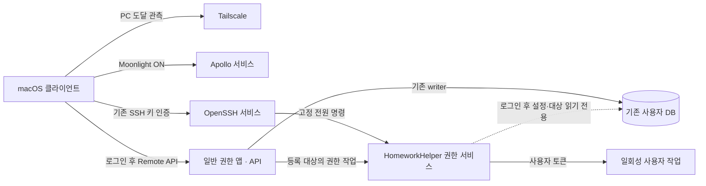

# Windows 호스트 수명주기와 권한 계약

## 사용자 동작

`lsh-desktop`은 사용자 로그인 전에도 Tailscale로 도달하고 Apollo/Moonlight로 로그인
화면에 접근할 수 있어야 한다. 이 상태를 전체 HomeworkHelper 준비 완료로 표시하지 않는다.
게임 데이터, 자동 출석, 게임 실행 등 전체 기능은 지정 사용자의 로그인과 앱 준비 이후 제공한다.
앱과 API는 일반 사용자 권한으로 실행하고 관리자 작업만 Windows 서비스에 요청한다.
설치·업데이트 시 승인은 필요하지만 정상 운영 중 UAC를 표시하지 않는다.

## 구조와 권위



- Tailscale와 Apollo는 Windows 자동 시작 서비스로 로그인 전 연결을 제공한다.
- 권한 서비스는 SYSTEM으로 실행하며 네트워크 포트를 열지 않는다. Windows SCM이
  수명주기를 관리한다. Qt, API, DB writer, 자동 출석은 서비스에 로드하지 않는다.
- 앱/API가 기존 사용자 데이터의 writer다. 권한 서비스는 로그인한 지정 사용자의
  설정과 등록 대상만 읽기 전용으로 조회하며 파일·디렉터리·DB를 만들거나 migrate하지 않는다.
- 설치 시 지정한 사용자 SID는 서비스 설치 설정의 단일 권위다. 초기 운영 대상은
  `lsh-desktop`의 `lsh93`다. 다른 사용자에게 자동 전환하지 않는다.
- 서비스에 게임 DB 복제본, 별도 페어링 저장소, 대상별 관리자 승인 목록을 만들지 않는다.

서비스의 SQLite 연결은 기존 DB에 `mode=ro`로 연결한다. 테이블·스키마·설정·게임 기록을
쓰지 않으며 없는 DB는 만들지 않는다. WAL 모드의 SQLite는 읽기에도 통상적인 `-wal`·`-shm`
공유 파일과 읽기 잠금을 사용할 수 있다. 이 동작을 별도의 앱 상태나 DB writer로 취급하지
않으며, live WAL을 무시하는 `immutable` 읽기나 DB 복제본으로 우회하지 않는다.

## 로그인과 권한

`run_on_startup`은 자동 시작 여부의 단일 설정이다. 지정 사용자의 로그인 이벤트에서
일반 사용자 토큰으로 앱을 한 번 시작한다. 잠금 해제는 로그인으로 처리하지 않고,
사용자가 닫은 앱을 반복 재시작하지 않는다. 기존 Startup 바로가기와 관리자/일반 예약
작업은 설치 전환 시 제거한다. GUI가 API를 소유하는 기존 수명주기는 유지한다.

로그인 이벤트는 서비스 초기화 중에도 보존한다. 서비스 시작 전의 기존 로그인과 초기화
중 도착한 신규 요청을 구분한다. 콜백은 전달 후 신속히 반환하며 한 실행 경계가 준비·
시작·완료를 소유한다. 일시 세션·토큰·설정 준비 실패는 1초 간격, 최대 120초 재확인한다.
설정 꺼짐, 이미 실행 중 확인, 실제 프로세스 생성에서만 완료 처리한다. 설정 없음·손상은
추측 실행 없이 기록한다. SID·세션·로그온을 확인하고 로그아웃·전환·중지 시 요청을 종료한다.
서비스 재시작은 기존 로그인에서 사용자가 닫은 앱을 다시 여는 사유가 아니다.

OBS는 지정 사용자 로그온, 정상 DB 준비 후 호스트 앱 시작, 명시적인 녹화/재연결 요청에서
준비한다. 로그온과 앱 시작은 앱 자동 시작·녹화 설정과 무관하다. 로그온 자동 시작과
`launch_obs` IPC의 확인·생성은 기존 서비스 작업 스레드 한 곳에서 순서대로 처리한다.
앱은 초기화당 한 번 비동기로 요청하며 설정 저장·화면 열기·주기 조회는 실행 트리거가 아니다.
사용자 종료·충돌·잠금 해제·절전 복귀·서비스 재시작으로 OBS를 반복 실행하지 않는다.
실행 경로와 숨김 설정만 기존 DB에서 읽는다. 같은 경로·SID·세션의 상승 OBS는 재사용하고
일반 권한 OBS는 강제 종료하지 않는다. 경로·토큰 오류는 앱의 일반 권한 시작을 막지 않는다.
숨김 실행은 `--minimize-to-tray`, 작업 디렉터리는 OBS 실행파일의 부모 폴더를 사용한다.
일반 앱은 OBS를 직접 생성하지 않고 기존 고정 IPC `launch_obs`만 사용한다. IPC 작업 대기는
최대 4초이며 시간 초과·세션 변경·서비스 중지 뒤 대기 작업은 늦게 실행하지 않는다.
이미 실행에 착수해 결과가 불명확하면 자동 재전송하지 않고 다음 요청에서 실제 프로세스를
확인한다. OBS 실행과 WebSocket 연결은 별도로 판정하며 연결 실패로 프로세스를 재실행하지
않는다. 녹화는 사용자가 요청할 때 시작하고, 호스트 앱 종료도 OBS를 종료하는 사유가 아니다.


`run_as_admin`은 관리자 기능 사용 여부다. 설정 변경은 앱을 재시작하지 않고 다음
작업에 적용한다. 일반 게임은 기본 사용자 토큰, 기존 관리자 정책상 상승 대상은
로그인한 관리자의 linked token으로 실행한다. 토큰이 없거나 표준 사용자이면 상승
작업을 거부한다. SYSTEM 토큰으로 게임을 대신 실행하지 않는다.

서비스 장애·미등록 시 일반 기능은 유지하고 권한 작업은 명시적으로 실패한다.
ShellExecute `runas`, 임시 예약 작업 등 자동 상승 fallback은 제공하지 않는다.
게임·런처 재시작 확인 등 사용자 의사결정은 일반 앱에서 마친 뒤 권한 작업을 요청한다.

## 로컬 IPC

서비스 이름은 `HomeworkHelperPrivilege`, 실행 파일은 `homework_helper_service.exe`다.
설치 사용자와 SYSTEM만 접근하는 로컬 named pipe를 사용하고 remote pipe 연결은 거부한다.
실제 클라이언트 PID, 토큰 SID, 설치 이미지 경로와 Windows 세션을 확인한다.
요청 본문의 SID/PID를 인증 정보로 취급하지 않는다.

| 작업 | 입력과 허용 범위 |
| --- | --- |
| `status` | 서비스와 지정 사용자의 현재 로그인 세션 상태 |
| `power` | 지정 사용자 로그온 후 `shutdown`, `restart`, `sleep`만 허용 |
| `launch_obs` | 지정 사용자 로그온 후 기존 OBS 경로·설정으로 상승 실행; 요청 경로/인자 없음 |
| `launch_managed` | 등록된 process ID와 기존 실행 모드 |
| `inspect_managed` | 등록된 process ID들의 실행 경로와 일치하는 프로세스 관측 |
| `stop_managed` | 등록 ID와 일치하는 사용자 프로세스; PID 지정 시 생성 시각도 일치해야 함 |

실행 경로와 인자 계산은 공유 순수 함수에서 수행한다. 권한 서비스는 자유 형식 셸 명령이나
등록되지 않은 경로를 IPC로 받지 않는다. 사용자 Shell이 필요한 실행은 해당 사용자 토큰의
일회성 작업 모드에서 수행한다. 작업 모드에 API·GUI·데이터 writer를 로드하지 않는다.
응답은 `accepted`, `status`, `message`와 작업별 관측값을 포함한다. 요청 처리 시작 시
확정한 사용자·Windows 세션·입력만 소비하고 로그아웃이나 세션 변경 후에는 거부한다.
지연 요청을 새 세션에서 재실행하지 않는다.

### 프로세스 감시와 시작 점검의 완료 경계

서비스 pipe는 서비스 수명 동안 유지하고 요청 사이에는 연결만 해제한다. 클라이언트는
최대 5초 동안 연결 확보를 기다리며, 다른 클라이언트가 먼저 접속하거나 서비스가 준비
중인 경우 연결 단계만 다시 시도한다. 요청을 전송한 뒤의 실패는 결과 불명확으로 전달하고
실행·종료·전원 명령을 자동 재전송하지 않는다. 실패에는 원본 Windows 오류를 남긴다.

시작 시 열린 게임 기록 점검은 기존 작업·backoff·타이머 경계에서 성공까지 유지한다.
점검 API 성공 후 주기 감시와 정상 heartbeat를 시작하여 이전 heartbeat를 먼저 덮어쓰지
않는다. 성공한 시작 점검은 절전 복귀나 화면 열기 때 반복하지 않는다. 같은 입력의 진행
중 감시는 중복 제출하지 않고, 변경된 입력만 기존 최신 요청으로 교체한다.

서비스 중단·인증 실패·시간 초과는 빈 프로세스 목록이 아니다. 실패한 관측은 실행 중인
게임·PID·세션 기록을 유지하며, 완료된 정상 관측으로만 시작·종료를 판정한다. DB 복구와
앱 종료는 대기 작업을 중지하고 늦은 응답을 반영하지 않는다. 실제 Windows의 동시 연결,
긴 관측, 시작 점검 재시도·중단과 게임 기록 비변경을 격리 데이터로 검증한다.

## 전원 제어

기존 SSH 인증으로 아래 고정 명령을 호출한다.

```powershell
& 'C:\Program Files\HomeworkHelper\homework_helper_service.exe' --control power sleep
```

`shutdown`과 `restart`도 같은 형식을 사용한다. CLI는 로컬 IPC로 서비스에 요청하고,
서비스가 Windows native power API를 호출한다. `rundll32 SetSuspendState`는 사용하지 않는다.
명령 수락 응답과 실제 전원 전환을 구분하고 자동 재전송·강제 종료로 확대하지 않는다.
앱 API의 온라인 여부는 전원 제어 조건이 아니다. 기존 SmartThings Wake는 유지한다.
전원·사용자 권한 작업은 로그온 후 지원 기능이다. 클라이언트는 기존 user_session_ready로
버튼을 허용하고 미로그온 시 "로그온 후 사용"을 안내한다. 로그인 전 Wake와 Moonlight는
독립적으로 유지한다. 로그인 전 권한 작업의 지원 확대는 백로그다.

## 클라이언트 상태

PC 도달 여부는 최신 Tailscale ping, 스트리밍 응답은 Apollo `serverinfo`, 전체 앱 기능은
기존 Remote API 인증과 응답으로 관측한다. 익명 `PairStatus`는 Moonlight 페어링 판정에
사용하지 않는다. 페어링과 Desktop 대상은 기존 Moonlight 설정을 사용한다.
관측과 Moonlight 실행 대상은 HomeworkHelper에 저장된 Base URL의 호스트가 소유한다.
별도 Moonlight host 선택 UI·설정·우선 선택 경로를 두지 않는다. 기존 Moonlight 등록에서
해당 호스트의 주소·이름과 일치하는 Desktop 대상을 찾으며, 관련 없는 등록을 대신 고르지 않는다.
Apollo 응답의 서버 식별자와 등록된 식별자 검증은 유지한다. 서버의 페어링 정보가 실제로
바뀌면 기존 PIN 페어링 절차를 사용하며, 자동 승인하거나 저장된 인증서를 재작성하지 않는다.

| 관측 | 사용자 결과 |
| --- | --- |
| PC/Apollo 응답, API 없음 | 호스트 대기; Moonlight 가능 |
| PC 응답, Apollo 없음 | 스트리밍 대기; Wake 재전송 금지 |
| API 인증 성공 | 기존 페어링됨·동기화 중 표시와 전체 기능 사용 |
| API 인증 거부, Apollo 응답 | 기존 인증 확인 필요 표시; Moonlight 유지 |
| PC 무응답 | 호스트 응답 없음; 물리 전원 꺼짐으로 확정하지 않음 |
| Tailscale 검사 실행 실패 | Tailscale 오류; 검사 생략과 구분 |
| 수락한 power 이후 전환 확인 | 기존 종료·부팅·재시동 대기 중 표시 유지 |

기존 페어링 해제됨·상태 확인 중·페어링됨·동기화 중·종료 대기 중·호스트 꺼짐·
부팅 대기 중·재시동 대기 중·재연결 중·서버 응답 없음·인증 확인 필요 문구는 유지한다.
단순한 네트워크 무응답은 새 호스트 응답 없음으로 표시한다. 별도 호스트 불일치 상태는
표시하지 않으며 Moonlight 등록·페어링 안내는 기존 설정 화면에서 제공한다.

관측 주기는 화면 사용 중 기본 5초(기존 사용자 간격 설정을 존중), 배경에서 15초다. 화면 열기, Mac 복귀, 호스트 변경,
버튼 클릭 시 즉시 관측한다. 호스트 identity가 다른 늦은 응답은 반영하지 않는다.
Moonlight ON과 Wake 후 재개는 전체 앱 API의 `.online`을 요구하지 않는다.
PC가 응답하면 Wake를 보내지 않는다. 게임 조작은 기존 API 인증과 준비를 요구한다.

## 검증과 배포 경계

연결·IPC·토큰·PID·읽기 전용 DB·로그인·지연 응답·installer 전환은 자동 검증한다.
실호스트 사용과 후보 설치·기능 시험은 사용자 승인 범위다. 합성 메시지/격리 데이터와
운영 설치본/물리 전원 시험을 구분하며 자동 테스트 PASS를 확대하지 않는다.

기존 dev-alwayson에서 작업 단위별 검증과 한국어 계층형 commit/push를 수행한다.
작업 실행과 에이전트 사용 규칙은 [AGENTS.md](../../AGENTS.md)를 따른다.
기존 PR #41을 갱신하며 open으로 유지한다. 구현 중 테스트 실패는 해결하고 전체 diff를
직접 코드 리뷰한다. 멀티에이전트 금지 중에는 독립 에이전트 리뷰를 요청하지 않는다.
기존 누적 변경과 이번 변경을 PR에 구분하고 외부 리뷰의 실제 실행 여부를 기록한다.

호스트·클라이언트의 빌드와 패키지 배포는 [빌드 가이드](../guides/build-guide.md)를
먼저 읽고 각 대상 환경의 `build.py` 실행 흐름을 따른다. 운영 DB
백업·정상 종료 뒤 기본 위치에 설치하고 서비스 등록·기존 시작 경로 정리·Tailscale 적용을
검증한다. Tailscale는 기존 설정을 보존하는 set --unattended=true와 종료 코드·timeout·
실제 적용값으로 확인한다. 미적용을 완료로 기록하지 않는다. 설치 디렉터리 선택과 이전
사용자 지정 위치 재사용은 하지 않는다.

DB 복구·게임/자원 쓰기는 [데이터 안전 정책](../data-safety-policy.md), 단일 GUI·네이티브
메시지는 [GUI 검증 문서](windows-gui-modernization.md)를 따른다.

### 실사용 검수 소유권

로그인 전 제품 Moonlight ON으로 로그인 화면 접근과 원격 부팅·게임 실행/종료는 사용자
실사용 확인을 통과했다(R17). 화면 검증은 사용자가 수행하며 에이전트는 명시 요청 때만
대응한다. 검수를 위한 임의 로그아웃·재부팅·종료와 기존 성공 시험 반복을 하지 않는다.
OBS의 다음 실제 로그온 자동 실행은 사용자 확인 전까지 실사용 검수 대기로 기록한다.
스마트 스케줄(R05)은 미사용 백로그이며 이번 보완에서 변경·제거·비활성화하지 않는다.
macOS UI 잘림(R14)은 사용자 결정에 따라 해결로 처리하고 재발 보고 시 다시 조사한다.
원인 수정이 검증됐다는 뜻으로 기록하지 않으며 추측 레이아웃 변경은 하지 않는다.

### 과거 전원 진단 계약

문서→구현→자동 검증/독립 리뷰→빌드/서명→백업/설치→비전원 실호스트 검증을 먼저 마친다.
전원 진단은 마지막에 실제 SYSTEM 서비스의 **현재 전원 API**로 수행한다. 절전/깨우기,
재시작/무로그인 연결, 지정 사용자 로그인/자동 시작을 확인한 뒤 시스템 종료를 마지막
전원 명령으로 시험한다. 기존 깨우기로 부팅해 종료 이벤트·새 boot 시각을 확인하며
자동 로그인 없이 원격 접근 가능한 상태로 끝낸다.

수락 뒤 120초 안에 전환이 관측되지 않으면 실패/미확인으로 기록한다. 자동 재전송,
강제 종료·다른 명령으로 확대하지 않는다. 깨우기 실패 시 추가 원격 전원 조작을 멈춘다.
네트워크 무응답만으로 물리 전원 꺼짐을 확정하지 않는다. 전원 API 결함은 호출 문맥,
수락·이벤트·관측과 후속 수정안을 보고하고 이 단계에서 API를 임의 교체하지 않는다.

## 사용자 설치 순서

1. 사용 중인 호스트 작업을 마친 뒤 Windows Setup EXE를 실행한다. 최초 설치·업데이트의
   관리자 승인으로 서비스 등록, 기존 Startup·예약 작업 정리, Tailscale 무인 실행
   설정을 적용한다. 기본 호스트 사용자는 `lsh93`이며 변경 시 `/HostUser=<계정>`을 지정한다.
2. 설치된 `homework_helper.exe`를 일반 권한으로 실행한다. 기존 데이터는 유지된다.
   앱의 `run_on_startup`과 관리자 기능 사용 설정을 확인한다.
3. macOS 클라이언트 산출물을 사용자 판단으로 설치한다. 기존 Tailscale 호스트, Moonlight
   페어링·Desktop, SSH 키 설정은 계속 사용한다.
4. 실화면과 다음 실제 로그온의 OBS 자동 실행은 사용자가 검수한다. 에이전트의 로그·API
   확인과 구분하며, 기존에 통과한 전원·Moonlight 시험을 설치 과정에서 반복하지 않는다.

Portable ZIP은 일반 기능을 바로 실행할 수 있지만, 사용자 쓰기 가능한 폴더의 EXE를
SYSTEM 서비스로 등록하지 않는다. 권한 기능은 Setup으로 보호된 경로에 설치한 앱·서비스를
사용하는 것을 권장한다. 수동 배치는 관리자 권한으로 전체 payload를 보호된 Program Files
경로에 배치하고 같은 폴더의 서비스 EXE로 `install --owner lsh93`을 실행해야 한다.
서비스는 등록된 폴더의 앱·서비스 EXE만 IPC 호출자로 허용한다. 다른 폴더에서 실행한
포터블 앱은 기존 서비스의 권한을 자동으로 공유하지 않는다.
