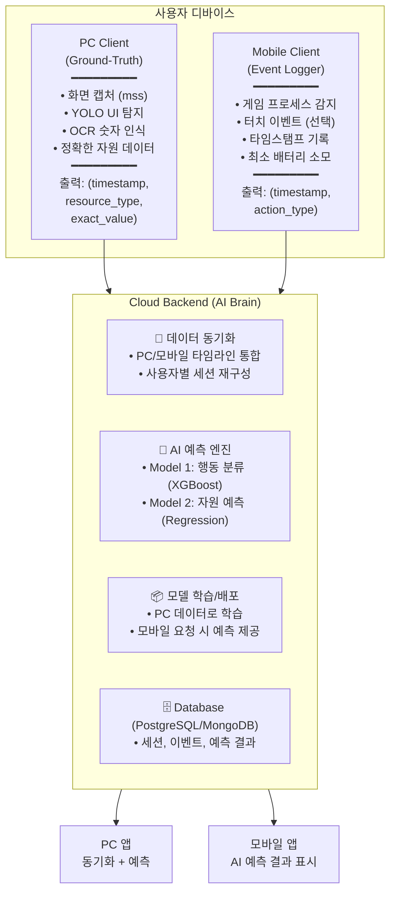
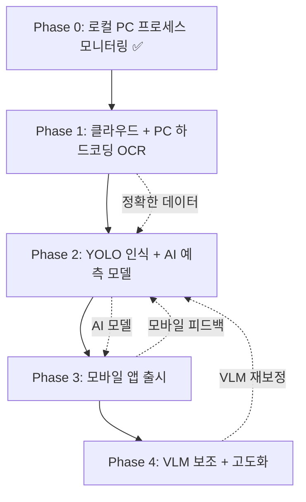

# 🚀 HomeworkHelper 프로젝트 마일스톤 로드맵

**프로젝트명**: HomeworkHelper
**최종 목표**: **PC/모바일 크로스 플랫폼** 지능형 게임 플레이 데이터 수집 및 예측 시스템
**작성일**: 2025-10-27
**버전**: v0.3 (Local-First Development Strategy)

---

## 📊 프로젝트 비전

### 🎯 핵심 목표

**현재 (Phase 0)**: PC 전용 게임 루틴 관리 도구
**목표 (Phase 4)**: PC/모바일 크로스 플랫폼 AI 기반 게임 데이터 수집 및 예측 서비스

### ⚡ 왜 크로스 플랫폼인가?

| 환경 | 가능한 것 | 불가능한 것 | 해결책 |
|------|----------|------------|--------|
| **PC** | 실시간 화면 인식 (OCR) | - | Ground-Truth 데이터 생성 |
| **모바일** | 타임스탬프, 터치 이벤트 수집 | 실시간 화면 인식 (배터리/성능) | AI 예측으로 자원 추정 |

**행동 예측 모델의 진짜 목적**: 단순 편의가 아닌 **모바일 환경에서 화면 인식 없이도 자원을 추정하기 위한 필수 구조**

---

## 🏗️ 크로스 플랫폼 아키텍처



**핵심 원칙**:
- **PC**: "정확한 데이터 수집기" (Heavy OCR)
- **모바일**: "경량 이벤트 로거" (Light Logger)
- **클라우드**: "AI 예측 및 동기화 중심" (Sync & AI)

---

## 📊 프로젝트 현황 요약

### ✅ 완료된 핵심 기능 (Phase 0)

1. **프로세스 모니터링 시스템**
   - psutil 기반 실시간 게임 프로세스 감지
   - 프로세스별 실행/종료 타임스탬프 자동 기록
   - 세션 기반 플레이 시간 트래킹

2. **알림 및 스케줄링**
   - 서버 리셋 시간 기반 알림
   - 사용자 주기 (24시간) 데드라인 추적
   - 필수 플레이 시간 알림
   - 수면 시간 보정 로직

3. **로컬 데이터 관리 시스템**
   - SQLite (WAL 모드) + SQLAlchemy ORM
   - FastAPI RESTful API 서버 (로컬)
   - 프로세스/세션/설정 CRUD 인터페이스

4. **빌드 및 배포 시스템**
   - PyInstaller onedir 모드 (MEI 폴더 문제 해결)
   - Inno Setup 인스톨러 자동화
   - daemon=True 설정으로 프로세스 종료 안정화

---

## 📅 단계별 마일스톤

---

## 🌐 Phase 1: 로컬 서버 아키텍처 + Android MVP + 데이터 수집 시스템

**목표**: VM 기반 서버 완성 + Android 앱 Phase 0 기능 통합 + Label Studio 데이터 수집 환경 구축
**예상 기간**: 3-4개월 (1인 개발 기준)
**핵심 기술**: FastAPI, PostgreSQL, Docker, Android (Kotlin/Java), Label Studio, OCR
**난이도**: ⭐⭐⭐ (Medium) - 서버/모바일/CV 복합 작업
**비용**: $0 (완전 로컬 환경, 클라우드 호스팅은 이후 Phase에서 진행)

### 1.1 VM + Docker 서버 아키텍처 구축

**목표**: 로컬 VM 환경에서 실제 프로덕션과 유사한 서버 아키텍처 완성 및 테스트

**작업 목록**:
- [ ] **VM 환경 셋업**
  - VirtualBox 또는 VMware로 Linux VM 생성 (Ubuntu 22.04 LTS 권장)
  - VM 네트워크 설정: Host-Only + NAT (로컬에서 API 접근 가능하도록)
  - SSH 접속 설정
- [ ] **Docker 컨테이너 아키텍처 설계**
  - `docker-compose.yml` 작성
  - 서비스 구성:
    - `fastapi-server`: FastAPI 백엔드 (Python 3.11)
    - `postgres`: PostgreSQL 15 (데이터베이스)
    - `nginx`: 리버스 프록시 (선택적, 프로덕션 유사 환경)
  - 볼륨 마운트: DB 데이터 영속성 보장
- [ ] **FastAPI 서버 개발**
  - RESTful API 엔드포인트:
    - `POST /api/v1/sessions` - 세션 데이터 업로드
    - `POST /api/v1/events` - 이벤트 데이터 업로드 (게임 내 자원 변화)
    - `GET /api/v1/sync/{user_id}` - 동기화 데이터 다운로드
    - `POST /api/v1/predict` - AI 예측 요청 (Phase 2에서 구현)
  - API 인증: JWT 토큰 기반
  - CORS 설정 (Android 앱 연동 대비)
- [ ] **데이터베이스 스키마 설계**
  - PostgreSQL 스키마:
    - `users` (id, username, password_hash, created_at)
    - `sessions` (id, user_id, process_id, start_ts, end_ts, duration)
    - `events` (id, session_id, event_type, resource_type, value, timestamp)
    - `predictions` (id, session_id, predicted_action, predicted_resource, confidence)
  - SQLAlchemy ORM 모델 정의
  - Alembic 마이그레이션 설정
- [ ] **사용자 인증 시스템**
  - 회원가입/로그인 API
  - JWT 토큰 발급 및 검증
  - 비밀번호 해싱 (bcrypt)

**결과물**:
- VM 환경에서 동작하는 Docker Compose 스택
- FastAPI 서버 (http://192.168.x.x:8000)
- PostgreSQL 데이터베이스 (로컬 VM)
- API 문서 (Swagger UI: http://192.168.x.x:8000/docs)

---

### 1.2 Android 앱 MVP - Phase 0 기능 통합

**목표**: Phase 0의 핵심 기능(프로세스 모니터링, 알림, 스케줄링)을 Android 플랫폼으로 이식

**작업 목록**:
- [ ] **Git 브랜치 전략 수립**
  - `main` (프로덕션), `develop` (개발), `feature/phase-1-android` (Android 앱)
  - Android 프로젝트 레포지토리 생성 (별도 또는 모노레포)
- [ ] **Android 프로젝트 셋업**
  - 개발 환경: Android Studio, Kotlin
  - Minimum SDK: API 26 (Android 8.0) - UsageStatsManager 지원
  - 아키텍처: MVVM + Jetpack Compose (또는 XML)
  - 의존성:
    - Retrofit (HTTP 클라이언트)
    - Room (로컬 DB)
    - WorkManager (백그라운드 작업)
    - Hilt (DI)
- [ ] **게임 프로세스 모니터링 구현**
  - UsageStatsManager API로 포그라운드 앱 감지
  - 목표 게임: 스타레일, 젠레스 존 제로
  - 게임 실행/종료 타임스탬프 자동 기록
  - WorkManager로 주기적 모니터링 (5분 간격)
- [ ] **로컬 데이터 관리**
  - Room 데이터베이스:
    - `sessions` (id, game_name, start_ts, end_ts, duration)
    - `settings` (id, key, value)
  - PC 버전과 동일한 데이터 구조 유지
- [ ] **알림 시스템**
  - 서버 리셋 시간 기반 알림 (게임별 설정)
  - 사용자 주기 (24시간) 데드라인 추적
  - NotificationChannel 설정 (Android 8.0+)
  - 수면 시간 보정 로직 (PC 버전 이식)
- [ ] **서버 동기화 기능**
  - Retrofit으로 VM 서버 API 연동
  - 로그인 후 세션 데이터를 서버로 자동 업로드
  - 네트워크 실패 시 로컬 큐에 저장 후 재시도 (WorkManager)
  - 서버 주소 설정 UI (개발용: http://192.168.x.x:8000)
- [ ] **기본 UI 구현**
  - 로그인/회원가입 화면
  - 게임 목록 화면 (스타레일, 젠레스)
  - 세션 히스토리 (오늘/이번 주/전체)
  - 설정 화면 (알림 시간, 서버 주소)

**결과물**:
- Android 앱 APK (Phase 0 기능 완료)
- UsageStatsManager 기반 프로세스 모니터링
- VM 서버 동기화 성공 확인
- 테스트 디바이스에서 동작 검증

---

### 1.3 Label Studio 기반 데이터 수집 시스템

**목표**: 기존 녹화 영상을 활용하여 유저 친화적 BBox 설정 시스템 구축 (하드코딩 방식 대체)

**작업 목록**:
- [ ] **Label Studio 환경 구축**
  - Docker로 Label Studio 설치 (VM 또는 로컬 PC)
  - 웹 UI 접속 설정 (http://localhost:8080)
  - 프로젝트 생성: "HomeworkHelper UI Detection"
- [ ] **기존 녹화 영상 전처리**
  - 목표 게임: 스타레일, 젠레스 존 제로
  - 영상에서 프레임 추출:
    - FFmpeg 사용: `ffmpeg -i recording.mp4 -vf fps=1 frames/frame_%04d.png`
    - 다양한 해상도별 추출 (FHD, QHD, 4K)
  - 게임별 최소 300-500장 확보
- [ ] **Label Studio 라벨링 템플릿 설정**
  - BBox 라벨 정의:
    - `stamina_icon` (개척력/배터리 아이콘)
    - `stamina_text` (자원 숫자 영역)
    - `currency_icon` (성옥/원석 아이콘)
    - `currency_text` (재화 숫자 영역)
    - `quest_checkbox` (일일 임무 체크박스)
  - XML 템플릿 작성 (RectangleLabels)
- [ ] **유저 친화적 라벨링 워크플로우**
  - Label Studio UI로 직관적으로 BBox 드래그 앤 드롭
  - 개발 환경 PC 해상도에 맞춰 라벨링 우선 진행
  - 라벨링 단축키 설정으로 효율성 향상
- [ ] **라벨 데이터 Export 및 활용**
  - Label Studio에서 JSON 형식으로 Export
  - JSON → YOLO 형식 변환 스크립트 작성 (Phase 2 대비)
  - 개발 환경용 BBox 좌표 추출:
    ```python
    # extract_bbox.py
    def extract_bbox_from_label_studio(json_path):
        # Label Studio JSON 파싱
        labels = parse_json(json_path)
        # 개발 PC 해상도별 BBox 좌표 추출
        bbox_config = {
            "stamina_text": {"x": 1000, "y": 50, "w": 150, "h": 30},
            ...
        }
        return bbox_config
    ```
  - 설정 파일 생성: `config/bbox_config.json`
- [ ] **OCR 라이브러리 선정 및 테스트**
  - Tesseract OCR, EasyOCR, PaddleOCR 성능 비교
  - 벤치마크 항목:
    - 한글/숫자 인식 정확도
    - 처리 속도 (FPS)
    - CPU/메모리 사용률
  - Label Studio로 라벨링한 BBox로 OCR 테스트
- [ ] **PC 클라이언트 통합 (선택적)**
  - Phase 0 PC 클라이언트에 데이터 수집 기능 추가
  - `bbox_config.json` 기반 자원 인식
  - 서버로 이벤트 데이터 업로드 (`POST /api/v1/events`)

**결과물**:
- Label Studio 프로젝트 (라벨링된 300-500장)
- `bbox_config.json` (개발 환경용 BBox 설정)
- JSON → YOLO 변환 스크립트 (`scripts/label_studio_to_yolo.py`)
- OCR 벤치마크 리포트
- YOLO 학습용 데이터셋 준비 (Phase 2에서 사용)

---

### 1.4 Phase 1 검증 및 안정화

**작업 목록**:
- [ ] **실전 테스트 (2주일)**
  - VM 서버 부하 테스트 (동시 요청 100개)
  - Android 앱 배터리 소모 측정 (< 5% 목표)
  - 서버 동기화 안정성 테스트 (네트워크 끊김 시나리오)
  - Label Studio 라벨링 데이터 품질 검증
- [ ] **성능 최적화**
  - Android 앱 백그라운드 프로세스 최적화
  - VM 서버 API 응답 시간 < 200ms
  - PostgreSQL 쿼리 최적화 (인덱스 추가)
- [ ] **문서화**
  - VM 서버 셋업 가이드 (`docs/vm-setup.md`)
  - Android 앱 빌드 가이드 (`docs/android-build.md`)
  - Label Studio 사용 가이드 (`docs/label-studio-guide.md`)
  - API 문서 완성 (Swagger UI)

**결과물**:
- Phase 1 완료 리포트
- VM 서버 + Android 앱 + Label Studio 통합 환경 완성
- 서버 동기화 성공률 ≥ 95%
- Phase 2 YOLO 학습을 위한 데이터셋 준비 완료

---

## 🤖 Phase 2: 클라우드 마이그레이션 + YOLO 인식 엔진 + AI 예측 모델 개발

**목표**: 로컬 서버를 클라우드로 이전 + 범용성 있는 데이터 수집기 개발 + AI 행동 예측 모델
**예상 기간**: 4-5개월 (클라우드 배포 + YOLO 학습 + AI 모델 개발)
**핵심 기술**: AWS/GCP/Vercel, YOLOv8/v11, XGBoost, Label Studio
**난이도**: ⭐⭐⭐⭐⭐ (Very High) - 클라우드 인프라 + CV + ML 복합 작업
**비용**: 발생 시작 (클라우드 호스팅, 월 $10-50 예상)

### 2.1 클라우드 마이그레이션 (VM → 실제 호스팅)

**목표**: Phase 1에서 완성한 VM 서버를 실제 클라우드 환경으로 이전

**작업 목록**:
- [ ] **클라우드 제공자 선택**
  - 옵션 1: AWS (EC2 + RDS) - 가장 범용적
  - 옵션 2: Vercel (FastAPI) + Supabase (PostgreSQL) - 무료 티어 활용
  - 옵션 3: GCP (Cloud Run + Cloud SQL) - 컨테이너 최적화
  - 옵션 4: Railway / Render - 1인 개발 친화적
  - 비용 비교 후 최종 결정 (초기에는 무료/저가 티어 활용)
- [ ] **Docker 컨테이너 배포**
  - Phase 1의 `docker-compose.yml`을 클라우드 환경에 맞게 수정
  - 환경 변수 설정 (DB 연결 정보, JWT 시크릿 등)
  - CI/CD 파이프라인 구축 (GitHub Actions)
    - `main` 브랜치 push → 자동 배포
- [ ] **데이터베이스 마이그레이션**
  - VM PostgreSQL → 클라우드 PostgreSQL (RDS/Supabase/Cloud SQL)
  - 데이터 백업 및 복원 테스트
  - 연결 보안 설정 (SSL/TLS)
- [ ] **도메인 및 HTTPS 설정**
  - 도메인 구매 (선택) 또는 클라우드 제공 URL 사용
  - SSL/TLS 인증서 설정 (Let's Encrypt 또는 클라우드 자동 발급)
  - API 엔드포인트: `https://api.homeworkhelper.com` (예시)
- [ ] **Android 앱 서버 주소 업데이트**
  - 하드코딩된 VM IP (`http://192.168.x.x:8000`) → 클라우드 URL
  - 환경별 설정 (개발/프로덕션) 분리
- [ ] **모니터링 및 알림 설정**
  - 서버 상태 모니터링 (Uptime, CPU, 메모리)
  - 에러 로그 수집 (Sentry 또는 CloudWatch)
  - 비용 알림 설정 (월 예산 초과 시 알림)

**결과물**:
- 클라우드 배포된 FastAPI 서버 (예: https://api.homeworkhelper.com)
- PostgreSQL 데이터베이스 (클라우드)
- CI/CD 파이프라인 (GitHub Actions)
- Android 앱 클라우드 서버 연동 완료
- 모니터링 대시보드

---

### 2.2 YOLO 기반 UI 탐지 시스템 개발

**목표**: 하드코딩 좌표 문제 해결 → 다양한 해상도/환경에서 동작하는 범용 인식기

**작업 목록**:
- [ ] **Label Studio 설치 및 환경 구성**
  - Docker 또는 pip 설치
  - 게임 플레이 영상 녹화 (각 게임당 1시간, 다양한 해상도)
- [ ] **게임 UI 요소 데이터셋 구축**
  - 라벨링 대상:
    1. **자원 아이콘**: 개척력 아이콘, 배터리 아이콘 (객체 탐지)
    2. **숫자 영역**: 자원 값이 표시되는 텍스트 영역 (BBox)
    3. **UI 컴포넌트**: 일일 임무 체크박스, 전투 상태 아이콘
  - **다양한 환경 녹화**:
    - 해상도 3종: FHD (1920x1080), QHD (2560x1440), 4K (3840x2160)
    - UI 스케일링 3종: 100%, 125%, 150%
    - 게임별 최소 500장 (9가지 환경 × 약 55장)
  - **비디오 타임라인 기반 라벨링** (Label Studio):
    - 개별 프레임이 아닌 **비디오 타임라인**에 직접 라벨링
    - 예: `[01:30 ~ 01:35]` 구간에 `quest_hud_bbox` 라벨 할당
    - BBOX 안의 텍스트 내용은 라벨링하지 않음 (OCR의 몫)
  - **SSIM 기반 스마트 샘플링**:
    - 장면 변화 감지 (Scene Change Detection) 로직 구현
    - 이전 프레임과 SSIM 유사도 측정:
      - SSIM > 0.98: "잠수 구간" → 프레임 버림 (과적합 방지)
      - SSIM < 0.85: "UI 팝업/배경 변화" → 프레임 저장
    - Python 스크립트: `scripts/smart_sampling.py` (OpenCV, scikit-image)
  - **데이터 품질 확보 전략**:
    - 단순 증강(Padding, Cropping)보다 **실제 환경 데이터 우선**
    - 다양한 해상도 및 화면 비율(16:9, 21:9 등)로 게임 재녹화
    - 게임 엔진이 UI를 재배치한 실제 화면 학습
  - Label Studio로 BBox 라벨링 → YOLO 형식 (COCO 또는 YOLO txt) Export
- [ ] **YOLOv8-nano 학습**
  - 경량 모델 선택 (nano 또는 small): 실시간 처리 + 낮은 리소스
  - 클래스 정의 예시:
    - `stamina_icon`, `stamina_text`, `battery_icon`, `battery_text`, `quest_check`
  - 학습 목표: mAP@0.5 ≥ 90%
  - 전이 학습 (Transfer Learning) 활용: COCO 사전 학습 모델 사용
- [ ] **YOLO + OCR 파이프라인 구축**
  ```python
  # yolo_detector.py
  class YOLODetector(ResourceDetector):
      def __init__(self):
          self.yolo_model = YOLO("models/game_ui_yolov8n.pt")
          self.ocr_engine = Tesseract()

      def detect(self, screenshot):
          # 1. YOLO로 UI 요소 탐지
          results = self.yolo_model(screenshot)

          # 2. 'stamina_text' 클래스 BBox 추출
          for box in results[0].boxes:
              if box.cls == 'stamina_text':
                  x, y, w, h = box.xywh
                  cropped = screenshot.crop((x, y, x+w, y+h))

                  # 3. OCR로 숫자 인식
                  text = self.ocr_engine.recognize(cropped)
                  return {"resource": "stamina", "value": parse_number(text)}
  ```
- [ ] **하드코딩 BBox → YOLO로 교체**
  - PC 클라이언트 코드에서 `HardcodedBBoxDetector` → `YOLODetector` 전환
  - A/B 테스트: 두 방식 성능 비교

**결과물**:
- YOLO 학습 데이터셋 (게임별 500-1000장)
- `game_ui_yolov8n.pt` (학습된 모델 파일, < 10MB)
- `yolo_detector.py` (YOLO + OCR 파이프라인)
- 성능 비교 리포트 (하드코딩 vs YOLO)

---

### 2.3 AI 행동 예측 모델 개발 (모바일 지원 핵심)

**목표**: 모바일에서 화면 인식 없이 "타임스탬프 + 행동 패턴"만으로 자원을 예측

**작업 목록**:
- [ ] **수동 피드백 시스템 구축**
  - PC 클라이언트 세션 종료 시 피드백 다이얼로그
  - "어떤 콘텐츠를 하셨나요?" 선택 UI
  - 콘텐츠 옵션:
    - 스타레일: [레이드, 시뮬레이션 우주, 일일 퀘스트, 자리비움]
    - 젠레스 존 제로: [공명 실험, 의뢰, 전투, 자리비움]
  - **UX 개선**:
    - 피드백 요청 빈도 조절 (초기 100회는 매번, 이후 10% 샘플링)
    - "오늘 하루 묻지 않기" 옵션
  - DB 저장: `user_feedback` (session_id, content_type, resource_left)
- [ ] **피처 엔지니어링**
  - **입력 피처 (X)**:
    1. `game_name` (원-핫 인코딩)
    2. `session_duration` (초)
    3. `start_hour` (0-23)
    4. `day_of_week` (0-6)
    5. `avg_session_duration` (해당 게임 평균 플레이 시간)
    6. `recent_sessions_count` (최근 24시간 세션 수)
  - **레이블 (y)**:
    1. Model 1 (분류): `content_type` (레이드, 일퀘, 자리비움 등)
    2. Model 2 (회귀): `resource_left` (종료 시 잔여 자원)
- [ ] **Model 1: 행동 분류 (XGBoost Classifier)**
  - "어떤 콘텐츠를 했는지" 예측
  - `predict_proba()` 활용하여 확률 출력:
    - 예: [레이드 70%, 일퀘 20%, 자리비움 10%]
  - 평가 지표: Accuracy ≥ 70%, F1-Score
  - 모델 저장: `models/action_classifier_v1.pkl` (< 5MB)
- [ ] **Model 2: 자원 예측 (XGBoost Regressor)**
  - Model 1의 예측값 + 피처 → 잔여 자원 예측
  - 평가 지표: MAE ≤ 20 (스타레일 개척력 기준), RMSE
  - 모델 저장: `models/resource_predictor_v1.pkl`
- [ ] **클라우드에 AI 예측 API 배포**
  ```python
  # FastAPI endpoint
  @app.post("/api/v1/predict")
  async def predict_resource(session: SessionData):
      # 1. Model 1 예측
      action_probs = model1.predict_proba(session.features)
      predicted_action = max(action_probs, key=action_probs.get)

      # 2. Model 2 예측
      features_with_action = [*session.features, predicted_action]
      predicted_resource = model2.predict(features_with_action)

      return {
          "predicted_action": predicted_action,
          "action_confidence": action_probs[predicted_action],
          "predicted_resource": predicted_resource
      }
  ```
- [ ] **PC 클라이언트에 AI 예측 통합**
  - 세션 종료 후 자동으로 `/api/v1/predict` 호출
  - 예측 결과 표시: "레이드를 하신 것 같아요 (70% 확률). 개척력 약 50 남았을 것으로 예상됩니다."
  - 사용자 확인: [맞아요] [아니요, 수정할래요]
  - 피드백을 다시 학습 데이터로 활용

**결과물**:
- `action_classifier_v1.pkl`, `resource_predictor_v1.pkl` (AI 모델)
- 클라우드 AI 예측 API 배포
- PC 클라이언트 AI 예측 통합
- 모델 성능 리포트 (정확도, MAE)

---

### 2.4 Android 앱 고도화 (AI 예측 통합)

**목표**: Phase 1 Android 앱에 AI 예측 기능 통합 + iOS 개발 시작 (선택)

**작업 목록**:
- [ ] **AI 예측 API 연동**
  - 게임 종료 시 자동으로 `/api/v1/predict` 호출
  - 예상 자원 표시: "개척력 약 50 남음 (AI 예측, 70% 확률)"
  - 실제 자원 수동 입력 옵션 (피드백)
  - 피드백 데이터를 서버로 전송하여 모델 재학습에 활용
- [ ] **UI/UX 개선**
  - 자원 트래킹 대시보드 추가
    - 일일/주간 플레이 통계
    - 자원 소모 패턴 그래프
  - AI 예측 결과 카드 디자인
  - 다크 모드 지원
- [ ] **iOS 앱 개발 (선택적)**
  - Phase 1 Android 앱을 기반으로 iOS 포팅
  - Swift/SwiftUI 또는 React Native/Flutter (크로스 플랫폼)
  - ScreenTime API로 프로세스 모니터링 (제한적)
  - TestFlight 베타 배포
- [ ] **오프라인 지원 강화**
  - 네트워크 끊김 시 AI 예측 실패 → 로컬 캐시 사용
  - 재연결 시 자동 동기화

**결과물**:
- Android 앱 v1.0 (AI 예측 통합)
- iOS 앱 프로토타입 (선택)
- TestFlight/내부 테스트 배포

---

### 2.5 Phase 2 검증 및 개선

**작업 목록**:
- [ ] 실전 테스트 (3주일)
  - YOLO 인식 정확도 검증 (다른 PC 환경에서 테스트)
  - AI 예측 모델 정확도 측정
  - 모바일 앱 배터리 소모 측정 (< 5% 일일 소모 목표)
- [ ] 모델 재학습
  - 피드백 데이터 누적 → v1.1 모델 생성
  - 성능 향상 확인
- [ ] 문서화
  - YOLO 학습 가이드
  - AI 모델 재학습 워크플로우

**결과물**:
- Phase 2 완료 리포트
- YOLO mAP ≥ 90%, AI 예측 정확도 ≥ 70%
- 모바일 앱 프로토타입 검증 완료

---

## 📱 Phase 3: 모바일 앱 정식 출시 (크로스 플랫폼 완성)

**목표**: 모바일 사용자에게 가치 제공 + PC-모바일 데이터 통합
**예상 기간**: 2-3개월
**핵심 기술**: React Native/Flutter, 모바일 API (AccessibilityService)
**난이도**: ⭐⭐⭐ (Medium) - 모바일 개발 경험에 따라 변동

### 3.1 모바일 앱 완성

**작업 목록**:
- [ ] **Android 고급 기능**
  - AccessibilityService로 게임 내 이벤트 감지 (선택적)
    - 주의: 사용자 권한 민감, 프라이버시 정책 명시 필요
  - 대안: 사용자가 수동으로 "일퀘 완료" 버튼 탭
- [ ] **iOS 제약 대응**
  - ScreenTime API로 앱 사용 시간만 트래킹
  - 터치 이벤트 불가 → 수동 입력 하이브리드 방식
- [ ] **푸시 알림**
  - 서버 리셋 2시간 전 알림
  - AI 예측 기반 알림: "개척력 거의 다 찼어요 (예상: 230/240)"
- [ ] **오프라인 지원**
  - 네트워크 끊김 시 로컬 DB에 저장
  - 재연결 시 자동 동기화
- [ ] **다크 모드, 다국어 (한/영)**

**결과물**:
- 모바일 앱 v1.0
- Google Play, App Store 제출

---

### 3.2 PC-모바일 데이터 통합

**작업 목록**:
- [ ] **통합 타임라인**
  - PC 세션 + 모바일 세션을 시간 순서로 재구성
  - 충돌 해결: 같은 시간대에 PC/모바일 동시 플레이 시 PC 우선
- [ ] **자원 자동 보정**
  - PC에서 정확한 자원 값 수집 → 클라우드 업데이트
  - 모바일 AI 예측값과 비교하여 모델 정확도 검증
- [ ] **역연산 로직** (HoYoLAB 연동 대비)
  - 나중에 정확한 데이터 확보 시 과거 예측값 보정
  - 예: 14시 종료 시 미확인 → 16시에 실제값 확인 → 14시 값 역산

**결과물**:
- PC-모바일 통합 타임라인 API
- 자동 보정 시스템

---

### 3.3 Phase 3 검증 및 안정화

**작업 목록**:
- [ ] 베타 테스트 (3-5명)
  - 다양한 기기에서 테스트 (Android/iOS, 다양한 해상도)
  - 배터리 소모 측정
  - AI 예측 정확도 피드백
- [ ] 성능 최적화
  - 모바일 앱 크기 < 30MB
  - 클라우드 API 응답 < 200ms (P95)
- [ ] 보안 강화
  - HTTPS 통신 (SSL/TLS)
  - JWT 토큰 만료 관리
  - 민감 데이터 암호화

**결과물**:
- Phase 3 완료 리포트
- 앱스토어 정식 출시
- 크로스 플랫폼 완전 작동

---

## 🔮 Phase 4: VLM 보조 시스템 + 고도화

**목표**: 유지보수 자동화 (VLM으로 UI 변경 대응) + 커뮤니티 기능
**예상 기간**: 6개월 이상 (지속적 개선)
**핵심 기술**: Claude Vision API, GPT-4V, HoYoLAB 스크래핑
**난이도**: ⭐⭐⭐⭐ (High) - 비공식 API 리버스 엔지니어링

### 4.1 VLM 기반 지능형 보정 시스템

**목표**: 게임 UI 업데이트 시 자동 대응 + 신규 게임 빠른 추가

**VLM 하이브리드 전략**:

| 상황 | 사용 기술 | 빈도 |
|------|----------|------|
| **실시간 데이터 수집** | YOLO + OCR | 매 프레임 (지속적) |
| **최초 설정** | VLM (Claude/GPT-4V) | 게임당 1회 |
| **UI 업데이트 감지 시 재보정** | VLM | 게임 패치 시 (월 1-2회) |

**작업 목록**:
- [ ] **VLM API 통합**
  - Claude Vision API 또는 GPT-4V 선택
  - 비용 최적화: 캐싱, 이미지 압축
- [ ] **"최초 설정" 워크플로우**
  ```python
  # vlm_calibration.py
  def initial_setup(game_name: str):
      # 1. 전체 스크린샷 캡처
      screenshot = capture_full_screen()

      # 2. VLM에게 UI 요소 위치 질의
      vlm_prompt = f"""
      이 {game_name} 화면에서 다음 UI 요소들의 위치를 JSON으로 반환해줘:
      1. 개척력/배터리 아이콘
      2. 자원 숫자 영역
      3. 일일 임무 체크박스

      출력 형식: {{"stamina_icon": {{"x": 100, "y": 50, "w": 30, "h": 30}}, ...}}
      """
      bbox_config = vlm_api(screenshot, vlm_prompt)

      # 3. 설정 저장
      save_game_config(game_name, bbox_config)

      # 4. YOLO 재학습을 위한 초기 데이터 생성
      generate_yolo_training_data(screenshot, bbox_config)
  ```
- [ ] **"재보정" 워크플로우**
  ```python
  # auto_recalibration.py
  def check_and_recalibrate():
      if ocr_failure_rate > 50%:  # 인식률 급감
          alert_user("게임 UI가 변경된 것 같습니다. 재보정을 시작합니다.")
          initial_setup(current_game)
          retrain_yolo()  # YOLO 모델 재학습
  ```
- [ ] **신규 게임 추가 간소화**
  - 사용자가 게임 이름 + 스크린샷만 제공 → VLM이 자동으로 UI 요소 탐지
  - YOLO 데이터셋 자동 생성 (VLM이 라벨링)
  - 개발자 개입 최소화

**결과물**:
- `vlm_calibration.py` (VLM 보정 시스템)
- PC 클라이언트에 "게임 추가 마법사" UI
- VLM 비용 리포트 (월 예상 $5-10)

---

### 4.2 외부 API 연동 (HoYoLAB)

**작업 목록**:
- [ ] **HoYoLAB 비공식 API 리버스 엔지니어링**
  - 개발자 도구로 API 엔드포인트 분석
  - 인증 방식 (쿠키, 토큰) 파악
- [ ] **자동 보정 시스템**
  - 주기적으로 (1시간마다) HoYoLAB에서 실제 자원 값 fetch
  - AI 예측값과 비교하여 차이가 크면 DB 자동 업데이트
- [ ] **역연산 로직 구현**
  - 과거 실패한 데이터 수집을 나중에 보정
- [ ] **리스크 관리**
  - Rate Limiting (시간당 10회 이하)
  - IP 차단 대응: User-Agent 로테이션
  - API 구조 변경 감지 및 알림

**결과물**:
- `hoyolab_scraper.py`
- 자동 보정 성공률 ≥ 80%

---

### 4.3 커뮤니티 기능 및 고급 분석

**작업 목록**:
- [ ] **익명화된 데이터 공유** (사용자 동의)
  - 커뮤니티 평균 통계 제공
  - "평균적으로 레이드는 30분 소요"
  - "70%의 플레이어가 저녁 8-10시 플레이"
- [ ] **글로벌 기본 모델 (전이 학습)**
  - 커뮤니티 데이터로 사전 학습된 AI 모델 제공
  - 신규 사용자 Cold Start 문제 해결
- [ ] **웹 대시보드**
  - React/Vue.js 프론트엔드
  - 게임별 플레이 타임 차트
  - 자원 소모 패턴 분석
  - 월간/연간 리포트
- [ ] **자동 재학습 파이프라인 (MLOps)**
  - 새 피드백 100개 누적 시 자동 재학습
  - 모델 버전 관리 (v1.2, v1.3, ...)
  - 성능 저하 시 이전 버전 롤백

**결과물**:
- 커뮤니티 통계 API
- 웹 대시보드 (https://dashboard.homeworkhelper.com)
- 자동 재학습 시스템

---

### 4.4 다국어 및 신규 게임 지원

**작업 목록**:
- [ ] **다국어 지원**
  - i18n 구현 (한국어, 영어, 일본어, 중국어)
  - AI 알림 메시지 다국어 템플릿
- [ ] **신규 게임 확장**
  - 원신, 붕괴 3rd, 명조 등
  - VLM 덕분에 게임당 추가 시간 1일 이내 목표
- [ ] **자동 업데이트 시스템**
  - PC: Inno Setup + GitHub Releases API
  - 모바일: 앱스토어 자동 업데이트

**결과물**:
- 4개 언어 지원
- 5개 이상 게임 지원
- 자동 업데이트 시스템

---

## 📊 성공 지표 (KPI)

### Phase 1 성공 기준
- [ ] VM 서버 배포 완료 (Docker Compose 스택 정상 동작)
- [ ] Android 앱 기본 기능 완성 (프로세스 모니터링, 알림, 서버 동기화)
- [ ] Android-VM 서버 동기화 성공률 ≥ 95%
- [ ] Label Studio 라벨링 완료 (게임별 300-500장)
- [ ] OCR 정확도 ≥ 85% (Label Studio BBox 기반)

### Phase 2 성공 기준
- [ ] 클라우드 배포 완료 (Uptime ≥ 99%)
- [ ] Android 앱 클라우드 서버 연동 성공
- [ ] YOLO mAP@0.5 ≥ 90%
- [ ] YOLO 인식 속도 < 100ms (PC)
- [ ] AI 행동 분류 정확도 ≥ 70%
- [ ] AI 자원 예측 MAE ≤ 20 (스타레일 기준)
- [ ] Android 앱 AI 예측 통합 완료

### Phase 3 성공 기준
- [ ] 앱스토어 정식 출시 (Google Play, App Store)
- [ ] 모바일 배터리 소모 < 5% (일일)
- [ ] PC-모바일 데이터 통합 성공률 ≥ 95%
- [ ] 월간 활성 사용자 50명 (베타)

### Phase 4 성공 기준
- [ ] VLM 재보정 성공률 ≥ 90%
- [ ] HoYoLAB 자동 보정 성공률 ≥ 80%
- [ ] 5개 이상 게임 지원
- [ ] 4개 언어 지원
- [ ] 월간 활성 사용자 200명

---

## ⚠️ 리스크 및 대응 방안

### 기술적 리스크

1. **게임 UI 업데이트 대응** ⚠️ **가장 중요**
   - 리스크: 게임 패치 시 YOLO 모델 인식 실패
   - 대응:
     - VLM 재보정 시스템 (Phase 4)
     - OCR 실패율 모니터링 → 임계값 초과 시 자동 알림
     - 커뮤니티 피드백: "UI 변경됨" 신고 기능

2. **YOLO 학습 데이터 부족**
   - 리스크: 500-1000장 데이터셋 구축에 시간 소요
   - 대응:
     - 데이터 증강 (Data Augmentation): 회전, 밝기 조절, 노이즈
     - VLM을 활용한 자동 라벨링 (Phase 4 앞당기기)

3. **모바일 데이터 수집 제약**
   - 리스크:
     - iOS에서 터치 이벤트 수집 불가
     - Android 접근성 권한 사용자 거부
   - 대응:
     - **수동 입력 하이브리드 방식**: "일퀘 완료" 버튼 탭
     - AI 예측 결과를 먼저 보여주고 확인만 받기

4. **AI 모델 과적합**
   - 리스크: 특정 사용자 패턴에만 최적화
   - 대응:
     - Cross-Validation
     - 정규화 (L1/L2 Regularization)
     - 커뮤니티 데이터로 글로벌 모델 학습

5. **HoYoLAB 스크래핑 차단**
   - 리스크: IP 차단, API 구조 변경
   - 대응:
     - Rate Limiting (시간당 10회 이하)
     - Graceful Fallback: 스크래핑 실패 시 AI 예측만 사용

---

### 데이터 수집 리스크

1. **초기 데이터 부족** (Cold Start)
   - 리스크: AI 모델 학습에 최소 150-250개 필요
   - 대응:
     - 피드백 UI 간소화 (버튼 2번만 클릭)
     - 인센티브 제공: "10회 피드백 후 고급 통계 열람"

2. **사용자 피로도 및 이탈** (UX 저하)
   - 리스크: 매번 피드백 요청하면 성가심
   - 대응:
     - 피드백 요청 빈도 조절 (초기 100% → 이후 10% 샘플링)
     - AI 확신도 60% 이상일 때만 자동 적용 (확인 생략)
     - "오늘 하루 묻지 않기" 옵션

---

### 프로젝트 관리 리스크

1. **범위 확대 (Scope Creep)**
   - 리스크: 너무 많은 기능 추가로 일정 지연
   - 대응: 각 Phase 완료 후 명확한 검증 단계

2. **1인 개발 한계**
   - 리스크: CV + ML + 모바일 + 클라우드 모두 전문 지식 필요
   - 대응:
     - Gemini CLI 협업
     - 오픈소스 라이브러리 최대 활용
     - 커뮤니티 포럼 질문 (Stack Overflow, Reddit)

3. **클라우드 비용 증가**
   - 리스크: 사용자 증가 시 서버/DB 비용 급증
   - 대응:
     - 초기 무료 티어 활용 (Vercel, Supabase)
     - 스케일링 전략: 사용자 100명 이상 시 유료 전환
     - 비용 모니터링 (월 $100 임계값 설정)

---

## 🔄 Phase 간 의존성



**핵심**: Phase 1의 로컬 아키텍처(VM + Docker + Android)가 모든 후속 Phase의 토대

---

## 📝 다음 액션 아이템 (Phase 1 시작)

### 즉시 시작 가능한 작업

**작업 0. [3일 내]** Git 브랜치 전략 수립
- `develop` 브랜치 생성
- `feature/phase-1-vm-server` 브랜치 생성 (VM + Docker 서버)
- `feature/phase-1-android` 브랜치 생성 (Android 앱)
- 브랜치 전략 문서 작성 (`docs/git-workflow.md`)

**작업 1. [1주일 내]** VM 환경 셋업 및 Docker 컨테이너 구축
- VirtualBox/VMware로 Ubuntu VM 생성
- Docker, Docker Compose 설치
- `docker-compose.yml` 작성 (FastAPI + PostgreSQL + nginx)
- VM 네트워크 설정 (Host-Only + NAT)

**작업 2. [2주일 내]** FastAPI 백엔드 기본 API 개발
- `POST /api/v1/sessions` 구현
- `POST /api/v1/events` 구현
- `GET /api/v1/sync/{user_id}` 구현
- JWT 인증 기본 구조
- PostgreSQL 스키마 설계 및 마이그레이션

**작업 3. [3주일 내]** Android 프로젝트 셋업 및 기본 기능 구현
- Android Studio 프로젝트 생성 (Kotlin + Jetpack Compose)
- UsageStatsManager로 게임 프로세스 모니터링
- Room 데이터베이스 설정
- VM 서버 API 연동 (Retrofit)

**작업 4. [1개월 내]** Label Studio 환경 구축 및 라벨링 시작
- Docker로 Label Studio 설치
- 기존 녹화 영상에서 프레임 추출 (FFmpeg)
- BBox 라벨링 템플릿 설정
- 게임별 300-500장 라벨링 시작

**작업 5. [1.5개월 내]** OCR 라이브러리 비교 테스트
- Tesseract, EasyOCR, PaddleOCR 벤치마크
- Label Studio BBox로 OCR 정확도 측정
- 최적 라이브러리 선택 및 `bbox_config.json` 생성

---

## 📚 참고 자료

### Phase 1 관련
- [FastAPI 공식 문서](https://fastapi.tiangolo.com/)
- [Supabase 시작 가이드](https://supabase.com/docs)
- [Vercel 배포 가이드](https://vercel.com/docs)
- [Docker 공식 문서](https://docs.docker.com/)

### Phase 2 관련
- [YOLOv8 공식 문서](https://docs.ultralytics.com/)
- [Label Studio 공식 문서](https://labelstud.io/guide/)
- [XGBoost 공식 문서](https://xgboost.readthedocs.io/)
- [React Native 공식 문서](https://reactnative.dev/)
- [Flutter 공식 문서](https://flutter.dev/)

### Phase 3 관련
- [Android UsageStatsManager](https://developer.android.com/reference/android/app/usage/UsageStatsManager)
- [iOS ScreenTime API](https://developer.apple.com/documentation/deviceactivity)
- [Firebase Cloud Messaging](https://firebase.google.com/docs/cloud-messaging)

### Phase 4 관련
- [Claude Vision API](https://docs.anthropic.com/claude/docs/vision)
- [GPT-4V API](https://platform.openai.com/docs/guides/vision)
- [HoYoLAB API (비공식)](https://github.com/thesadru/genshin.py)

---

## 📌 마일스톤 관리

### 업데이트 이력
- **v0.1 (2025-10-27)**: 초기 로드맵 작성 (PC 중심)
- **v0.2 (2025-10-27)**: 크로스 플랫폼 아키텍처 전면 수정
  - Phase 1에 클라우드 백엔드 추가
  - Phase 2에 YOLO + AI 예측 모델 통합
  - Phase 3을 모바일 앱 집중
  - Phase 4에 VLM 보조 시스템 추가
- **v0.3 (2025-10-27)**: Phase 1 로컬 환경 중심으로 재구성
  - Phase 1을 VM + Docker + Android + Label Studio로 변경
  - 클라우드 마이그레이션을 Phase 2로 이동 (비용 절감)
  - 하드코딩 BBox 대신 Label Studio 기반 데이터 수집
  - Android 앱 MVP를 Phase 1에 통합

### 다음 리뷰 예정일
- **Phase 1 시작 후 1개월**: VM 서버 + Android 앱 진행 상황 점검
- **Phase 1 완료 시**: Phase 2 클라우드 마이그레이션 및 YOLO 학습 상세 계획 업데이트

---

## 🎯 프로젝트 성공을 위한 핵심 원칙

1. **크로스 플랫폼 First**: PC와 모바일을 처음부터 염두에 두고 설계
2. **데이터 품질 > 속도**: AI 모델은 데이터 품질에 좌우됨
3. **점진적 개선**: 완벽한 시스템보다 빠른 MVP + 지속 개선
4. **사용자 피드백**: 커뮤니티 의견을 적극 반영
5. **비용 관리**: 클라우드 비용 모니터링 필수

---

**작성자**: HomeworkHelper Development Team
**최종 수정**: 2025-10-27
**문서 버전**: v0.3 (Local-First Development Strategy)

**다음 목표**: Phase 1 VM 서버 + Android 앱 + Label Studio 환경 구축 시작 🚀
